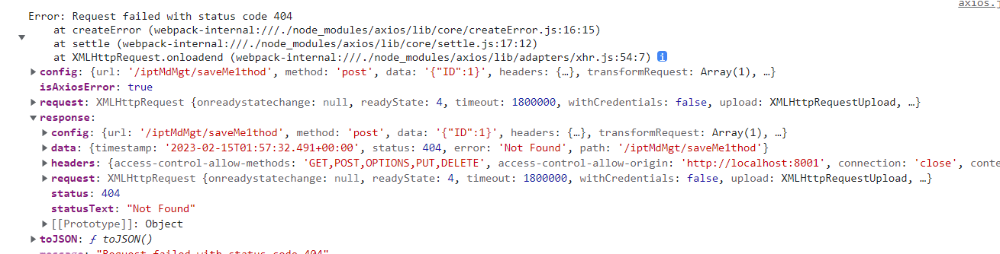

# axios

Axios 是一个基于 *[promise](https://javascript.info/promise-basics)* 网络请求库，作用于[`node.js`](https://nodejs.org/) 和浏览器中。 它是 *[isomorphic](https://www.lullabot.com/articles/what-is-an-isomorphic-application)* 的(即同一套代码可以运行在浏览器和node.js中)。在服务端它使用原生 node.js `http` 模块, 而在客户端 (浏览端) 则使用 XMLHttpRequests。

中文官网：https://www.axios-http.cn/docs/intro

重要的是在项目中使用的axios，以vue项目为例

## axios的安装

```bash
npm install axios
```

或者

```bash
yarn add axios
```

## axios的使用

一般情况下，项目中的axios都会进行封装起来。为什么需要进行封装，因为我们在正式的项目中，可以需要对请求进行拦截，然后做出一些处理，所以我们需要进行一些封装。

接下来我们就进行封装。首先我们需要在项目下创建`request` 或者`server` 或者`api`文件夹，名字的话，一般取有象征意义的。然后我们在这个文件夹下面创建`axios.js`和`index.js`

### 导入axios

在`axios.js`文件夹中，我们导入`axios`。

```js
import axios from "axios";
```

### 设置重发请求

```js
axios.defaults.retry = 4; // 发送请求次数
axios.defaults.retryDelay = 1000; // 请求间隔时长
```

### 创建拦截器

#### 响应拦截器

响应拦截器，在**请求得到响应之后**，对响应体的一些处理，通常是数据统一处理等，也常来判断登录失效等

```js
axios.interceptors.response.use((function (response) {
    // 2xx 范围内的状态码都会触发该函数。
    // 对响应数据做点什么
    return response;
  }, function axiosRetryInterceptor(err) {
    // 超出 2xx 范围的状态码都会触发该函数。
    // 对响应错误做点什么
  return Promise.reject(err);
});
```

平时都是对出现的一些异常进行处理

```js
axios.interceptors.response.use((function (response) {
    // 2xx 范围内的状态码都会触发该函数。
    // 对响应数据做点什么
    return response;
  }, function axiosRetryInterceptor(err) {
    // 如果没有错误直接返回
    if (!err.response) return;
  	return Promise.reject(err);
});
```

对报错`4xx`和`5xx`报错进行一些处理，在错误信息里面有个`err`

我们可以通过`console.dir("err", err)`查看错误对象的具体信息



```js
axios.interceptors.response.use((function (response) {
    // 2xx 范围内的状态码都会触发该函数。
    // 对响应数据做点什么
    return response;
  }, function axiosRetryInterceptor(err) {
    // 如果没有错误直接返回
    if (!err.response) return;.
    
    const { status } = err.response;
    
    if (status === 401) {
        //清除token
        localStorage.removeItem("eleToken");
        //重新登录
        router.push("/login");
    } else if (status === 403) {
        msg("error", "您没有访问该模块数据的权限!");
    } else if (status === 500) {
        msg("error", "服务器错误!");
    } else {
        msg("error", "未知错误!");
    }
    //最后返回promise包裹的err
  	return Promise.reject(err);
});
```

#### 请求拦截器

在**请求发送前**进行必要操作处理，例如添加统一cookie、请求体加验证、设置请求头等，相当于是对每个接口里相同操作的一个封装

```js
// 请求拦截
axios.interceptors.request.use(
  (config) => {
    //设置请求头
    if (localStorage.eleToken) {
      config.headers.Authorization = localStorage.eleToken;
    }
    return config;
  },
  (error) => {
    return Promise.reject(error);
  }
);

```

以上就是我们封装的`axios` 接下来，我们就开始封装方法，比如`get` `post`

### get方法封装

在`request/index.js`中

```js
import axios from "./axios"; // 刚刚封装的axios

export async function get(url, params) {
  const res = await axios({
    url: url,
    params: params,
    method: "get",
  })
  return res.data ? res.data : res;
}

```

### post 方法封装

在`request/index.js`中

```js
export async function post(url, params) {
  const res = await axios({
    url: url,
    data: params,
    method: "post",
  })
  return res.data ? res.data : res;
}
```

### 使用方法

然后我们创建`api.js`这个文件，放在`request`中可以，单独放在`viewers`下每个模块文件夹下面也行，我们这里放在每个模块下面。

比如有个模块`viewers/Home`,然后`api.js`就创建在`Home`下面。

```js
import { get, post } from "../../request";

// 获取首页数据
export function getHomeData(data) {
  return get("/home/query", data);
}

// 发送数据
export function postHome(data) {
  return post("/home/params", data);
}
```

然后再组件之中我们导入方法，就可以使用了

```vue
import { getHomeData, postHome } from ".api.js";
```

### 取消请求

取消请求的话，因为我们是以vue为基础实现的，所以我们将`cancel(取消请求的函数)`挂载到vue实例上。

在`index.js` 中

```js
export async function post(url, params, that) {
  const res = await axios({
    url: url,
    data: params,
    method: "post",
    cancelToken: new axios.CancelToken(function executor(c) {
      that.source = c;
    }),
  })
  return res.data ? res.data : res;
}	
```

在`api.js`中

```js
export function queryHome(data, that) {
  return post("/queryHome/query", data, that);
}
```

在vue组件中

```js
queryInterpretationV2(data, this).then((res) => {
        if (this.source) {
            //如果this上存在source,就调用方法
          	this.source();
        }
}
```


