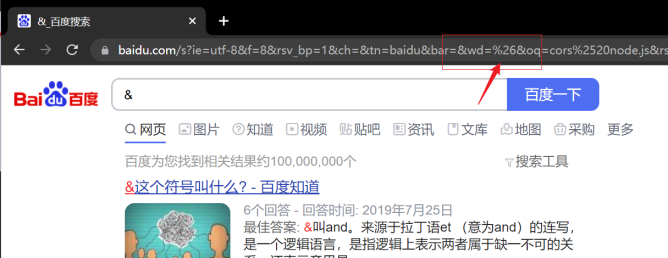
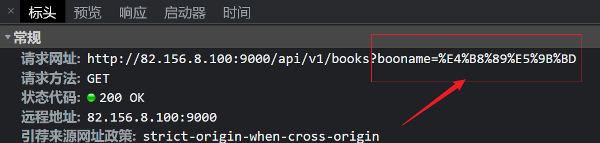
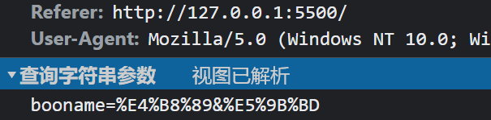
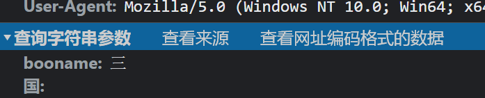

## AJAX 核心对象 XMLHttpRequest

### XMLHttpRequest 介绍

 jQuery 中的 AJAX 方法，都是基于浏览器中的原生对象 XMLHttpRequest 封装出来的。XMLHttpRequest 简称 xhr，是浏览器提供的一个对象，是AJAX的核心对象。它的作用是可以向服务器发送和接收网络请求。它让我们可以以编程的方式和服务器进行交互。

- 官方文档
   - [https://developer.mozilla.org/zh-CN/docs/Web/API/XMLHttpRequest](https://developer.mozilla.org/zh-CN/docs/Web/API/XMLHttpRequest)
### 发送 GET 请求

- 步骤：
   - 创建 xhr 对象
   - 调用 xhr.open() 方法，设置请求信息
   - 注册 xhr 的 load 事件，加载完毕处理数据
   - 调用 xhr.send() 方法，发送请求

- 示例代码：

```javascript
let xhr = new XMLHttpRequest();

xhr.open('GET', 'http://82.156.8.100:9000/api/v1/books');

// 当请求加载完毕后执行，这里的 responseText 是服务器返回的数据，字符串类型
xhr.onload = function () {
  console.log(xhr.responseText);
};

// 发送请求，可以不带参数
// xhr.send();
xhr.send(null);
```

   - 这里的接收到的 `xhr.responseText` 就是获取的服务器返回的响应数据
   - 现在接收到的 `xhr.responseText` 是 JSON 形式的字符串
   - 可以通过 `JSON.parse()` 转换成 JavaScript 中的对象

```javascript
let data = JSON.parse(xhr.responseText);
console.log(data);
```

### 发送带参数的 GET 请求

根据图书名称查询图书列表，发送请求的时候需要携带用户要搜索的图书名称。

在发送的请求地址后面携带请求参数(**查询字符串**)，格式如下：

```javascript
http://82.156.8.100:9000/api/v1/books?bookname=三国
```

可以携带多个参数，通用格式如下：

```javascript
url?参数1=值1&参数2=值2&参数3=值3
```

- **注意：值没有引号**
- 请求路径中的 ? 是查询字符串开始的标志
- 查询字符串中的 & 符号是多值之间的分隔符
- jQuery 中 GET 请求传参的方式，最终转换成查询字符串的形式

```javascript
let xhr = new XMLHttpRequest();

// 请求路径中携带请求参数
xhr.open('GET', 'http://82.156.8.100:9000/api/v1/books?bookname=三国');

xhr.onload = function () {
  console.log(xhr.responseText);
};

xhr.send();
```
### URL 编码和解码

假设我们查询的书名中有 & 符号或者 ?，这个时候会怎么样？ 我们可以通过百度搜索来测试，在百度搜索框中搜索 & 符号。



可以正常搜索到结果，注意观察地址栏，百度搜索的时候也是发送的带参数的 GET 请求，请求地址中的 wd 就是我们搜索的内容，wd 后面就是 & 符号，但是像 &、?、=、: 等，在 URL 中都有特殊含义，所以搜索的内容中如果出现这些符号会做特殊的处理，否则请求路径会出现问题。

这种特殊的处理就是 **URL 编码**，URL 编码就是对路径中的特殊符号、以及汉字进行编码，编程成 &+2位16进制数字的形式。

在服务端收到 URL 请求的参数后会对内容进行解码，还原成原来的内容，这种操作叫做 **URL 解码**。

监视我们上一小节中发送请求网络请求，如下：



可以看到在发送请求的时候会自动会汉字的参数进行 URL 编码。

如果搜索的内容是：三&国，这个时候发送数据的形式是什么样子呢？

实际传递的参数样子：



解码之后的样子：



你可以发现，我们搜索的 三&国，中的 & 符号在这里被作为了分隔符，而我们想要搜索的内容为：三&国。

所以要解决上面的问题，需要自己对 URL 参数进行 URL 编码，服务器收到浏览器发送的数据之后要进行 URL 解码。

```javascript
// URL 编码
encodeURIComponent('三&国');
// 输出结果：%E4%B8%89%26%E5%9B%BD

// URL 解码
encodeURIComponent(code)
// 输出结果：三&国
```

- 建议始终对 GET 请求的参数进行 URL 编码

### 发送 POST 请求

- 步骤：
   - 创建 xhr 对象
   - 调用 xhr.open() 方法，设置请求信息
      - 设置请求头 Content-Type
         - 作用告诉服务器，发送过去的数据格式
   - 注册 xhr 的 load 事件，加载完毕处理数据
   - 调用 xhr.send(**data**) 方法，发送请求，传入 POST 数据

```html
// 请求头中的 Content-Type
// 作用：告诉服务器我post过去的数据的样子， 服务器要根据这个属性来解析数据
// Content-Type: text/plain;charset=UTF-8
//               text/plain 文本类型的数据
//               application/x-www-form-urlencoded   键=值&键=值
```

- 示例代码：

```javascript
let xhr = new XMLHttpRequest();

// 请求路径中携带请求参数
xhr.open('POST', 'http://82.156.8.100:9000/api/v1/login');

// 注意：这里必须设置
// 值 application/x-www-form-urlencoded 的作用是告诉服务器 POST 的数据格式是：键=值
xhr.setRequestHeader('Content-Type', 'application/x-www-form-urlencoded');

xhr.onload = function () {
  let data = xhr.responseText;
  console.log(JSON.parse(data));
};

xhr.send('username=js&password=123456');
```

- **POST 请求注意**
   - POST 发送的数据，浏览器会自动进行 URL 编码
   - 请求头中的 Content-Type 必须设置，作用是告诉服务器发送过去的数据格式
      - application/x-www-form-urlencoded：发送的数据格式为，键=值&键=值
      - 服务器会自动处理接收到的数据，把键=值&键=值的字符串转换成对象：{ 键: 值, 键: 值 }

### 发送 DELETE 请求

- 步骤：
   - 创建 xhr 对象
   - 调用 xhr.open() 方法，设置请求信息
   - 注册 xhr 的 load 事件，加载完毕处理数据
   - 调用 xhr.send() 方法，发送请求

- 示例代码：

```javascript
let xhr = new XMLHttpRequest();

xhr.open('DELETE', 'http://82.156.8.100:9000/api/v1/books/1');

// 当请求加载完毕后执行，这里的 responseText 是服务器返回的数据，字符串类型
xhr.onload = function () {
  let data = xhr.responseText;
  console.log(JSON.parse(data));
};

xhr.send();
```

### GET 和 POST 的区别

-  GET
   - 参数拼接在 url（`url?name=1&age=30`）
   - 由于浏览器对 url 长度的支持（各个浏览器均不同）是有限，所以它只能附加少量的数据
   - 不能传递隐私数据
-  POST
   - 要设置请求头: `xhr.setRequestHeader('content-type','application/x-www-form-urlencoded')`
   - 参数写在 send() 方法中: `send('username=js&password=123456')`
   - 相对于 POST 来说，没有传参大小的限制
      - 传大量数据
      - 上传文件
   - 隐私数据需要使用 POST
### xhr 的状态 readyState

#### onreadystatechange 事件

`onload` 是 HTML5 以后新增的方便获取响应的事件，一些老的浏览器(IE6, IE7, IE8)对 onload 是不支持的。

在 HTML5之前，获取服务器返回内容的时候使用的是 `onreadystatechange`事件，这个事件是在 xhr 对象状态变化时被触发，而一次请求过程中，`XMLHttpRequest` 对象的状态会发生`多次变化`，也就意味着这个事件会被触发多次。

onreadystatechange

```javascript
let xhr = new XMLHttpRequest();
xhr.open('get', 'http://82.156.8.100:9000/api/v1/books');
// onreadystatechange
xhr.onreadystatechange = function () {
  console.log('事件被触发了');
};
xhr.send();
```

#### `xhr` 对象的状态

一共有5种，用 `readyState` 属性表示，详见下表

| readyState | 状态描述 | 说明 |
| --- | --- | --- |
| 0 | UNSENT | XHR被创建，但尚未调用 `open()`方法。 |
| 1 | OPENED | `open()`方法已经被调用，建立了连接。 |
| 2 | HEADERS_RECEIVED | `send()`方法已经被调用，并且已经可以获取状态行和响应头。 |
| 3 | LOADING | 响应体下载中，`responseText`属性可能已经包含部分数据。 |
| **4** | **DONE** | 响应体下载完成，可以直接使用 `responseText` |

演示 xhr.reayState：
```javascript
let xhr = new XMLHttpRequest();
// 0
console.log(xhr.readyState);
xhr.open('get', 'http://82.156.8.100:9000/api/v1/books');
// 1
console.log(xhr.readyState);
// onreadystatechange
xhr.onreadystatechange = function () {
  // 2 3 4
  console.log(xhr.readyState);
};
xhr.send();
```

- 接收服务器返回数据，需要判断 readyState 的值为 4 的时候

```javascript
let xhr = new XMLHttpRequest();
xhr.open('get', 'http://82.156.8.100:9000/api/v1/books');
// onreadystatechange
xhr.onreadystatechange = function () {
  // 判断服务器返回的状态码是否是200
  if (xhr.status === 200) {
    // 判断 xhr 的状态是否为 4
    if (xhr.readyState === 4) {
      console.log(xhr.responseText);
    }
  }
};
xhr.send();
```

### 同步和异步(重要)

关于同步与异步的概念在生活中有很多常见的场景，举例说明。

> - 同步：一个人在同一个时刻只能做一件事情，在执行一些**耗时**的操作（不需要看管）不去做别的事，只是**等待**
> - 异步：在执行一些耗时的操作（不需要看管）去做别的事，而不是等待 


`xhr.open()` 方法第三个参数要求传入的是一个 `bool` 值，其作用就是设置此次请求是否采用**异步**方式执行，**默认**为 `true`，如果需要**同步**执行可以通过传递 `false` 实现：

```javascript
console.log('before ajax');
let xhr = new XMLHttpRequest();
// 默认第三个参数为 true 意味着采用异步方式执行
xhr.open('GET', 'http://82.156.8.100:9000/api/v1/books', true);
xhr.onload = function () {
  // 这里的代码最后执行
  console.log('request done');
};
xhr.send(null);
console.log('after ajax');
```

如果采用同步方式执行，则代码会卡死在 `xhr.send()` 这一步：

```javascript
console.log('before ajax');
let xhr = new XMLHttpRequest();
// 同步方式
xhr.open('GET', 'http://82.156.8.100:9000/api/v1/books', false);
// // 同步方式 执行需要 先注册事件再调用 send，否则 readystatechange 无法触发
// xhr.onload = function () {
//   // 这里的代码最后执行
//   console.log('request done')
// }
xhr.send();
// 因为 send 方法执行完成 响应已经下载完成
console.log(xhr.responseText);
console.log('after ajax');
```

演示同步异步差异。

> 了解同步模式即可，切记不要使用同步模式。


至此，我们已经大致了解了 AJAX 的提供的基本 API 。

### XMLHttpRequest API 总结

#### 属性

- `readyState`  xhr的状态  4 响应体接收完毕
- `status`       获取状态码
- `responseText`  获取响应体，文本格式
- `responseXML`  获取响应体，xml格式
- `onreadystatechange`   事件，当xhr.readyState属性发生改变触发
- `onload` 事件，HTML 5 中新增，属于 XMLHttpRequest 2 中新增 API

#### 方法

- `open(method, url, async)`   设置请求的方式，请求的路径， 同步/异步
- `send(requsetBody)`    发送请求(体)， POST请求的时候，会自动对发送的数据进行URL编码
- `setRequestHeader(key, value)`  设置请求头
- `getResponseHeader(key)`   获取响应头

## XMLHttpRequet 2.0

### `XMLHttpRequest` 的缺点

- 无法指定接收到的响应类型 
- 只支持文本数据的传输，无法用来读取和上传文件 
- 传送和接收数据时，没有进度信息，只能提示有没有完成 

### `XMLHttpRequest 2` 的新功能

- 可以设置 HTTP 请求的超时时间
- 可以设置预期的返回数据类型
- 可以使用 `FormData` 对象管理表单数据 
- 可以上传文件 
- 可以获得数据传输的进度信息

### 设置`HTTP`请求时限

有时受网络或者服务器的影响 AJAX 的操作变得很慢，而且无法预知要花多少时间。如果网速很慢，用户可能要等很久。新版本的 `XMLHttpRequest` 对象，增加了 `timeout` 属性，可以设置 `HTTP` 请求的超时时长：

```javascript
xhr.timeout = 3000
```

上面的代码中将最长等待时间设为 3000 毫秒，过了这个时限，就自动停止 HTTP 请求。
与之配套的还有一个 `timeout` 事件，用来指定超时后执行的回调函数：

```javascript
xhr.ontimeout = function (e) {
	console.log('请求超时');
};
```

### 设置预期的响应数据格式

在前面使用原生的 AJAX 过程中，我们提到了从服务器端获取的数据一般从 xhr.responseText 中获取，而这个值一般情况下是一个 JSON 字符串，所以我们要使用 JSON.parse() 来转一下这个字符串。

但是，如果已经确切地知道了从服务器端回来的数据格式是 JSON 字符串，那么我们在发出 AJAX 请求之前，提前去设置 xhr.responseType 属性值，这样得到的数据就可以直接从 xhr.response 中拿了。

如果你已经能够知道从服务器中返回的数据类型，就可以通过:

1. 预先设置 xhr.responseType = "类型名"
2. 直接从 xhr.response 中拿结果

#### API 介绍

- responseType： 预期服务器返回数据的类型 
   - '' 空：表示文本，和 text 一样，空为默认值
   - text：文本
   - json：JSON格式数据
   - document：文档对象
- response：根据 responseType 的值自动转换返回结果的类型，可以接收任何类型的结果

#### 示例

```javascript
let xhr = new XMLHttpRequest();
xhr.open('get', 'http://82.156.8.100:9000/api/v1/books');
xhr.responseType = 'json';
xhr.onload = function () {
  console.log(typeof xhr.response);
  console.log(xhr.response);
  // Uncaught DOMException: Failed to read the 'responseText' property from 'XMLHttpRequest': The value is only accessible if the object's 'responseType' is '' or 'text' (was 'json').
  console.log(xhr.responseText);
};
xhr.send();
```

- 不需要再次对 xhr.responseText 进行转换
- 不能再使用 xhr.responseText，会报错。应该使用 xhr.response

### FormData

以前 AJAX 操作只能向服务器提交字符串格式的数据，无法上传文件，现在可以通过 FormData 对象提交 **二进制** 的数据。Form|Data 给我们带来两个好处：

- 快速收集 form 表单中的数据，减少表单元素的拼接，提高工作效率
- 上传文件

#### 收集表单数据

- 页面结构
```html
<form id="myform">
  <div>
    <label for="">用户名</label>
    <input type="text" name="username" />
  </div>
  <div>
    <label for="">密码</label>
    <input type="password" name="password" />
  </div>
  <div><button id="btn" type="button">登陆</button></div>
</form>
```

- 发送请求
```javascript
let btn = document.querySelector('#btn');
btn.onclick = function () {
  let myform = document.querySelector('#myform');
  // 收集表单数据
  let formData = new FormData(myform);

  let xhr = new XMLHttpRequest();
  xhr.responseType = 'json';
  xhr.open('POST', 'http://82.156.8.100:9000/api/v1/login');
  xhr.onload = function () {
    console.log(xhr.response);
  };
  xhr.send(formData);
};
```

- FormData 对象内部有一个键值对集合，其中的键名就是表单元素的 name 属性名，而值就是这个表单元素当前的值。
- 当使用 FormData 发送请求的时候，不需要设置 Content-Type，浏览器会自动设置 FormData

#### 自定义键值对

上面的案例中，我们是从表单中快速获取所有的表单元素的值，并以键值的形式保存在 FormData 对象中。除了这种方法之外，还可以手动决定收集哪些值，或者额外添加哪些值。

- 静态页面
```html
<form id="myform">
  <div>
    <label for="">用户名</label>
    <input type="text" id="username" name="username" />
  </div>
  <div>
    <label for="">密码</label>
    <input type="password" id="password" name="password" />
  </div>
  <div><button id="btn" type="button">登陆</button></div>
</form>
```

- 发送请求
```javascript
let btn = document.querySelector('#btn');
btn.onclick = function () {
  let username = document.querySelector('username');
	let password = document.querySelector('password');

  let myform = new FormData();
  
  // FormData 添加自定义键值
  myform.append('username', username);
  myform.append('password', password);
  
  // 添加其他数据
  // myform.append('xx', xx);

  let xhr = new XMLHttpRequest();
  xhr.responseType = 'json';
  xhr.open('POST', 'http://82.156.8.100:9000/api/v1/login');
  xhr.onload = function () {
    console.log(xhr.response);
  };
  xhr.send(formData);
};
```

#### 上传文件

- 上传文件接口地址：[http://82.156.8.100:9000/api/v1/upload](http://82.156.8.100:9000/api/v1/upload)
   - Field name：pic
- input:file 

   - accept：限制上传文件的路径，用逗号分隔的 [MIME-Type](https://developer.mozilla.org/zh-CN/docs/Web/HTTP/Basics_of_HTTP/MIME_types)
   - multiple：多选

- 静态页面

```html
<input id="file" type="file" multiple accept="image/*">

<input id="btn" type="button" value="上传">
<br>

```

- 发送请求
```javascript
let btn = document.querySelector('#btn');
btn.onclick = function () {
  let file = document.querySelector('#file');
  // 当前选择的文件，是FileList集合
  console.dir(file.files)
  
  // file.files[0]
  // 一个文件对象，包含下面的成员，可以判断文件大小和类型
  // name: "1.jpg"
  // size: 15462
  // type: "image/jpeg"

  // 准备 formData，添加选择的图片
  let formData = new FormData();
  formData.append('pic', file.files[0]);

  let xhr = new XMLHttpRequest();
  xhr.responseType = 'json';
  xhr.open('POST', 'http://82.156.8.100:9000/api/v1/upload');
  xhr.onload = function () {
    let img = document.querySelector('#img');
    let res = xhr.response;

    img.src = 'http://82.156.8.100:9000/' + res.data
  }
  xhr.send(formData);
};
```

#### 上传进度

- 核心：

   - xhr对象中有一个子对象upload（xhr.upload），upload对象中有一个事件 onprogress。
   - onprogress事件大约每100ms触发一次，其回调函数第一个参数是一个事件对象，这个事件对象中有两个属性 loaded 和 total 
      - loaded：表示已上传文件的大小
      - total： 表示文件总大小

- 实现思路：

   - 制作进度条，使用两层嵌套的div即可：第一层是进度条的外边框，第二层才是进度条
   - 每次onprogress事件触发时： 
      - 都计算当前已上传文件大小的百分比
      - 根据百分比去重绘进度条长度（宽度值可以是百分比值）

- 样式文件

```css
.outer {
    height: 20px;
    background: #171b3c;
    border-radius: 20px;
    box-shadow: 0 2px 2px #4f4c4c;
    margin-bottom: 40px;
    position: relative;
}
.inner {
    position: absolute;
    border-radius: 20px;
    width: 0%;
    height: 20px;
    background: #ef2d56;
}
```

- 核心代码

```javascript
let innerDom = document.querySelector('.inner');
innerDom.style.width = 0;
xhr.upload.onprogress = function (ev) {
  // 已上传 / 总大小
  console.log((ev.loaded / ev.total) * 100 + '%');
  // 设置百分比值
  innerDom.style.width = (ev.loaded / ev.total) * 100 + '%';
};
```

#### 本地图片预览

文件控件选中图片后，文件控件中会保存图片信息它的 files 属性中。files 属性是一个数组，如果只选中了一张图片，这张图片就放在 files[0] 中，如选了多张图片，则类似后推。

对于这些文件信息（本例中的文件就是用户选中的图片），我们通过`URL.createObjectURL()`来创建一个临时的路径，这个路径可能是像这样：

```
blob:http://localhost:5500/fc517910-1300-44f3-a6e8-d52f56f34e4e
```

你可以通过打一个新的浏览器窗口，并在地址栏中输入这个路径来访问这张图片。注意，它只是临时的，如果你关闭了选中图片的网页，这张图片也将会不可访问。

- 静态文件

```html
<input id="file" type="file" multiple accept="image/*">
<br>

```

- 核心代码

```javascript
let fileInput = document.querySelector('#file');
fileInput.onchange = function (e) {
  let file = this.files[0];

  let url = URL.createObjectURL(file);
  document.querySelector('#img').src = url;
}
```

## 响应数据格式

前端人员通过 AJAX 请求从服务器获取数据，数据拿回来之后，可能还需要做一步的操作，例如：如果是一个数组，则要遍历数组。

那么掌握服务器返回的数据的表现形式是非常重要的环节，只有知道了这些格式，我们才能更好去处理这些数据。

了解服务器端返回数据在类型上的区别；会对 JSON 进行操作，简单了解 XML

内容：

- 观察三种不同的返回值
- 深入学习 JSON
- 简单学习 XML

### 了解三个不同结构的字符串

以4大名著书本信息为例，比较三种文件的回传的数据比较。

- 文本：普通字符串
- JSON：JSON 格式的字符串
- XML：XML 格式的字符串

直接在浏览器中打开三个接口，列出结果如下：

- 格式1：

```html
作者：吴承恩，书名：西游记；作者：施耐庵，书名：水浒传；作者：罗贯中，书名：三国演义；作者：曹雪芹，书名：红楼梦
```

- 格式2：

```javascript
[
    {"author":"吴承恩","name":"西游记"},
 	  {"author":"施耐庵","name":"水浒传"},
  	{"author":"罗贯中","name":"三国演义"},
  	{"author":"曹雪芹","name":"红楼梦"}
]
```

- 格式3

```xml
<?xml version="1.0" encoding="utf-8" ?>
<booklist>
  <book>
    <author>吴承恩</author>
    <name>西游记</name>
  </book>
  <book>
    <author>施耐庵</author>
    <name>水浒传</name>
  </book>
  <book>
    <author>罗贯中</author>
    <name>三国演义</name>
  </book>
  <book>
    <author>曹雪芹</author>
    <name>红楼梦</name>
  </book>
</booklist>
```

哪一种格式的字符串更好读？为什么？

> Tip: 同样是作文，字迹字体也有工整之分。
> 

### JSON

发送 AJAX 请求时，从服务器端返回的数据格式要统一，这样才能让不同的后端语言，不同的前端人员都 能读懂，都方便操作，这时我们就可以使用JSON格式。

它用于描述数据，它比普通字符串更具有表达力！

#### 如何判断返回值是 JSON 字符串

观察几个真实的 JSON 数据：

从服务器返回的数据都是字符串格式的，如何判断数据是JSON字符串格式的？

[在线验证json格式]([http://www.bejson.com/](http://www.bejson.com/)）
> tip: 直接在线进行字符串校验，判断一个字符串是不是 JSON 字符串。


#### JSON是什么

JSON:  JavaScript Object Notation(JavaScript 对象表示法) 。

- JSON 是一种通过普通**字符串**描述数据的手段，用于表示有结构的数据。
- JSON 是轻量级的文本数据交换格式,类似 XML。
- JSON `独立于编程语言`  （php,java,go,js 都会通过它来进行数据交流）
- JSON 具有自我描述性，更易理解

#### JSON字符串常见格式

作为前端人员，我们是通过调用服务器端接口的方式来获取JSON字符串，也就是说，我们一拿到数据，它是JOSN格式的，而这个JSON格式的数据显然是由后端同学给提供的。

但是，我们也要知道如何去写出一个标准的JSON字符串。

有如下三种情况：

-  普通字符串 
-  数组字符串  

```javascript
'["a","b","c"]'
```

做法是：在javascript数组前后加上单引号，变成字符串就行。

-  对象字符串  
```json
'{"name":"curry","age":40}'
```

做法是：

1. 在javascript对象的属性名加上'双引号'（`不能用单引号`）;
2. 把整个对象前后加上单引号

#### JSON字符串相关的两个操作

-  把JSON字符串转成具体某个编程语言中的数据格式；
-  在某个编程语言中，把数据格式转成JSON字符串；

|  | 从JSON字符串转成编程语言支持的数据 | 从数据类型转成JSON字符串 |
| --- | --- | --- |
| JavaScript | JSON.parse() | JSON.stringify() |
| PHP | json_decode() | json_encode() |
| Java | JSON.parseObject(),JSON.parseArray() | JSON.toJSONString |


JavaScript 中提供了一个静态对象 JSON 来处理 json 数据。 它与 Math 相似，不需要 new，而是直接通过对象名.方法来调用。

##### JSON.stringify

功能：把js数据，转成JSON格式的字符串

格式：`var JSON字符串 = JSON.stringify(js数据)`

```javascript
// 1.把js中的数组，对象 转成 JSON字符串
var arr = [1, 2, 3, 'ok', 'hello'];
var arr_jsonStr = JSON.stringify(arr);
console.info(arr, typeof arr);
console.info(arr_jsonStr, typeof arr_jsonStr);

var obj = { name: 'flex', age: 30, favoriate: ['篮球', '前端'] };
var obj_jsonStr = JSON.stringify(obj);
console.info(obj, typeof obj);
console.info(obj_jsonStr, typeof obj_jsonStr);
```

##### JSON.parse

功能：把JSON格式的字符串，还原成JS中的数据格式

格式：`let JS数据 = JSON.parse(JSON字符串)`

### XML(简单了解)

可扩展标记语言（Extensible Markup Language）。

-  XML 于 1998 年 2 月 10 日成为 [W3C](https://baike.baidu.com/item/W3C) 的推荐标准。 
-  它提供了一种描述结构数据的格式，简化了网络中[数据交换](https://baike.baidu.com/item/%E6%95%B0%E6%8D%AE%E4%BA%A4%E6%8D%A2)和表示，使得代码、数据和表示分离，并作为数据交换的标准格式。 
-  独立于编程语言的。 
-  AJAX（异步的javascript和XML）中的 X 就是 XML 

#### 示例

假设这个文件的名字为books.xml

```xml
<?xml version="1.0" encoding="utf-8" ?>
<booklist>
  <book>
    <author>吴承恩</author>
    <name>西游记</name>
    <price>15</price>
  </book>
  <book>
    <author>施耐庵</author>
    <name>水浒传</name>
  </book>
  <book>
    <author>罗贯中</author>
    <name>三国演义</name>
  </book>
  <book>
    <author>曹雪芹</author>
    <name>红楼梦</name>
  </book>
</booklist>
```

#### 操作（了解）

如果 AJAX 所请求的接口，明确规定返回值是 XML 格式，你可以通过：

-  通过 xhr.responseXML 来获取内容。
-  拿到这个内容之后，就像操作 DOM 元素一样去访问其中的内容。 

```javascript
let books = xhr.responseXML.getElementsByTagName('book')
for (var index = 0; index < books.length; index++) {
    let element = books[index]
    console.log(element.getElementsByTagName('author')[0].innerHTML)
}
```

### XML vs JSON

相同点：

- 都用来描述数据格式
- 与具体的编程语言无关
- 有自己文件格式的后缀名 .xml 和 .json 的文件

区别

- JSON 有简易的语法（JavaScript 基因）；XML有规范的标签（HTML 基因）
- JSON 存储效率更高，XML 中有冗余标签
## 封装 AJAX

原生 AJAX 使用起来比较繁琐，每次发送 AJAX 请求，都会有很多重复的代码。接下来我们仿照 jQuery 中的 ajax 方法，自己动手来封装一个 ajax 函数，最终的效果和 jQuery.ajax() 使用起来几乎一致。

回顾 $.ajax() 用法：

```javascript
$.ajax({
	type: 'GET',
  url: '',
  data: {},
  success: function (data) {},
  error: function () {}
})
```

### 函数的参数

接下来我们开始来封装 ajax 函数，它需要一个配置对象作为参数，配置对象中的成员和 $.ajax() 相同：

- options.type：请求方式
- options.url：请求路径
- options.data：请求携带的参数，GET|POST 都可能携带
- options.success：请求成功之后的回调函数，接收服务器返回的结果
```javascript
function ajax(options) {
  options.type = options.type || 'GET';
}
```
### 处理 data 参数

我们传递给 ajax 函数的 data 选项是一个对象，最终发送请求的时候需要转换成 `键=值&键=值` 形式的字符串，我们先来写一个函数处理这件事情：

```javascript
function query(data) {
  if (!data) return data;
  let arr = [];
  for (let k in data) {
    let str = k + '=' + data[k];
    arr.push(str);
  }

  return arr.join('&');
}
```

### 封装 XMLHttpRequest

```javascript
function ajax(options) {
  options.type = options.type || 'GET';

  let data = query(options.data);

  let xhr = new XMLHttpRequest();
  xhr.responseType = 'json';
  xhr.open(options.type, options.url);
  xhr.onload = function () {
    // xhr.response
  }
  xhr.send(data);
}
```

### 判断请求方式

```javascript
function ajax(options) {
  options.type = options.type || 'GET';

  let data = query(options.data);

  // 如果是 GET 请求 URL 后面拼接 data
  if (options.type.toLowerCase() === 'get') {
    options.url += '?' + data;
  }


  let xhr = new XMLHttpRequest();
  xhr.responseType = 'json';
  xhr.open(options.type, options.url);
  // 如果是 POST 请求，设置 Content-Type
  if (options.type.toLowerCase() === 'post') {
    xhr.setRequestHeader('Content-Type', 'application/x-www-form-urlencoded');
  }
  xhr.onload = function () {
    // xhr.response
  }
  xhr.send(data);
}
```

### 设置回调函数

```javascript
xhr.onload = function () {
  options.success && options.success(xhr.response)
}
```

### 测试

```javascript
ajax({
  type: 'get',
  url: 'http://82.156.8.100:9000/api/v1/books',
  data: { bookname: '三国' },
  success: function (res) {
    console.log(res);
  }
})


ajax({
  type: 'post',
  url: 'http://82.156.8.100:9000/api/v1/login',
  data: {
    username: 'js',
    password: '123456'
  },
  success: function (res) {
    console.log(res);
  }
})
```

