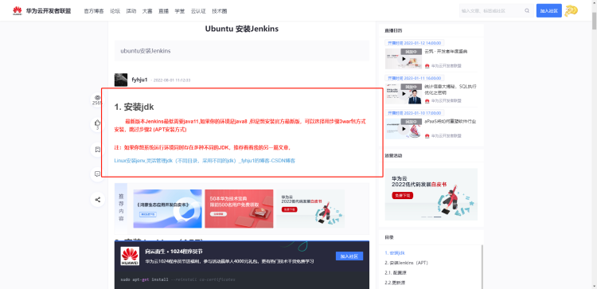

# 背景
今天突然收到消息说我们前端也要实现自动打包部署，说用Jenkins，让我们研究一下。这个任务到了我的头上，我还是想要研究一下这玩意儿怎么玩的，刚好我有服务器，我就用来玩了。中间玩脱了好多次，都不知道怎么就玩不了了，因为我服务器没啥东西，我就直接重装服务器，历经多次的重装之后，有点上路的意思，然后慢慢的跑通了，这个笔记是记录我的过程，中间可能有些报错我记不住了，但是我尽自己最大的可能还原。

# 前言

首先介绍一下，我都实现了哪些功能。监听**Git **的变化、自动下载代码、自动打包、自动部署。

这里就需要介绍到第一个坑的地方，就是如果你想玩，那么就建议用**Gitee，**因为**GitHub**有个大家都知道的毛病，就是会被墙，这也是我最开始的时候第一步总是跑不起来的原因之一，卡了很久，后来经过打大佬点拨了一下，才注意到这个事情，希望读者注意一下。

使用的技术Jenkins+Gitee+Nginx的方案来搭建；服务器是Ubuntu，ubuntu使用（apt-get install 软件名） 来安装软件，redhat(即CentOS)服务器使用（yum install 软件名） 命令安装。开始行动。

**PS:本文贴出来的链接都是对本人有启发或者有帮助的链接，本着原创精神，我将其贴出来了，有兴趣的可以看看。现在这个步骤是我根据很多文章摸索出来的，有问题的话请百度。同时本人Linux极差，要是有命令有误的地方，请见谅。**

# 安装java jdk

这里是第二个值得注意的地方，**目前的最新版Jenkins是不支持java8的，最低要求是java11，**现在是2023年2月4日，Jenkins的版本是2.375.2。目前我现在的这个算是目前最新的版本，我最开始的时候装的就是java8，跑不起来，然后看到一个文章（已经贴出来了），才重新安装的jdk。<br />
## 起步
借助链接：[Ubuntu安装jdk11_fx9590的博客-CSDN博客_ubuntu安装jdk11](https://blog.csdn.net/fx9590/article/details/124060480)
### 命令查看java11相关包

```shell
apt-cache search java11
```

```shell
root@VM-8-5-ubuntu:~# apt-cache search java11
default-jdk - Standard Java or Java compatible Development Kit
default-jdk-headless - Standard Java or Java compatible Development Kit (headless)
default-jre - Standard Java or Java compatible Runtime
default-jre-headless - Standard Java or Java compatible Runtime (headless)
openjdk-11-jdk - OpenJDK Development Kit (JDK)
openjdk-11-jdk-headless - OpenJDK Development Kit (JDK) (headless)
openjdk-11-jre - OpenJDK Java runtime, using Hotspot JIT
openjdk-11-jre-headless - OpenJDK Java runtime, using Hotspot JIT (headless)
openjdk-17-jdk - OpenJDK Development Kit (JDK)
openjdk-17-jdk-headless - OpenJDK Development Kit (JDK) (headless)
openjdk-17-jre - OpenJDK Java runtime, using Hotspot JIT
openjdk-17-jre-headless - OpenJDK Java runtime, using Hotspot JIT (headless)
```
### 选择安装的jdk版本
```shell
sudo apt-get install openjdk-11-jdk
```
输入`**y**`继续安装。
### 配置环境
安装完成后配置环境变量，执行`sudo vi ~/.bashrc`，在文件的最后添加以下信息，注意把`JAVA_HOME`改成你自己的`java`路径，我的默认安装路径是`/usr/lib/jvm/java-11-openjdk-amd64`。下面有两个注意点，看完再关编辑器。
```shell
JAVA_HOME=/usr/lib/jvm/java-11-openjdk-amd64
JRE_HOME=$JAVA_HOME/jre
JAVA_BIN=$JAVA_HOME/bin
CLASSPATH=.:$JAVA_HOME/lib/dt.jar:$JAVA_HOME/lib/tools.jar:$JRE_HOME/lib
PATH=$PATH:$JAVA_HOME/bin:$JRE_HOME/bin
export JAVA_HOME JRE_HOME PATH CLASSPATH
```
这里有两个注意点：<br />1、`sudo vi ~/.bashrc`，`vi`命令是用于进入`Linux`操作系统之下的文本编辑工具。

- 进入之后，按`i`能看见左下角`insert`的字样，此时就可以正常输入。
- 输入完成之后，首先按`ESC`，会看见左下角的`insert`消失，此时就直接输入`:w`，这就是冒号+w,代表意思是保存刚刚编写的内容
- 保存之后，按`:q`，这个代表的意思是退出。
- 同时呢也可以直接`:wq`直接就是保存退出。
- 也可以强制保存退出`:wq!`
- 如果提示你对文件操作的权限不够，那么就给权限，在我这里因为是自己的服务器，玩坏了重装就行，如果是公司的，一般都有东西在上面，慎重。
```shell
### linux里的权限配置。
### 给目录可读 可写  可执行的权限
sudo chmod -R 777 /web 给web文件夹最高权限  777 代表最高权限

sudo chmod 600 /web 只有web文件夹所有者有读写权限

sudo chmod 644 /web web文件夹所有者有读写权限，其他用户只有读的权限

sudo chmod 66 /web 每个人都有读写的权限
```
2、关于`.bashrc`文件中的`JAVA_HOME`，一般情况下默认就是上面的那个地址，但是如果你确实想知道或者说不知道，在安装的时候会出现准确的安装地址，到时候，自己仔细观察一下，就能看到那些安装包放在哪儿的。

到这里说明你前面已经配置完毕，最后还需要使配置立即生效。
```shell
source ~/.bashrc
```
### 查看
安装完成后输入命令查看jdk版本
```shell
java -version
```


# 安装nginx
到这里呢，说明jdk已经安装完毕了，接下来就是安装`nginx`，安装`nginx`很简单。

执行以下命令安装nginx

```shell
sudo apt-get update
sudo apt-get install nginx
```
安装完成后nginx默认打开，在浏览器输入你的服务器ip(公)，就可以看到页面，页面默认路径是/var/www/html，如果没看到，请检查安装时是否报错，以及检查是否已经开放80端口。

查看Nginx状态：

```bash
sudo systemctl status nginx
```

停止Nginx

```bash
sudo systemctl stop nginx
```

启动Nginx

```bash
sudo systemctl start nginx
```

重启Nginx

```bash
sudo systemctl reload nginx
```

强制重启Nginx

```bash
sudo systemctl restart nginx
```

https://www.idcspy.com/18206.html

## 配置文件
这里按照逻辑情况如果出现上面能正确打开页面，看到`Nginx`的字样。这里其实还有东西没有配置，这里就放在最后配置。

# 安装Nodejs

因为我们需要在后面的脚本之中用到nodejs，所以我们这里还是需要安装一下nodejs。这里需要值得注意的是这里的nodejs，最好是跟你的本地项目中的版本是一致的。

比如安装`node.js 8.x` 

```js
curl -sL https://deb.nodesource.com/setup_8.x | sudo -E bash -
sudo apt-get install -y nodejs
```

如果安装`node.js 9.x` 

```js
curl -sL https://deb.nodesource.com/setup_9.x | sudo -E bash -
sudo apt-get install -y nodejs
```

当你安装好之后，那么就使用以下命令

```bash
root@VM-8-5-ubuntu:/home/www# node -v
v14.21.2
root@VM-8-5-ubuntu:/home/www# npm -v
6.14.17
```

出现以上的字样就表示安装成功了。

# 安装Jenkins

首先，将存储库秘钥添加到系统中
```shell
wget -q -O - https://pkg.jenkins.io/debian/jenkins-ci.org.key | sudo apt-key add -
```
添加密钥后，系统将返回OK 。 接下来，我们将Debian包存储库地址附加到服务器的sources.list ：
```shell
echo deb http://pkg.jenkins.io/debian-stable binary/ | sudo tee /etc/apt/sources.list.d/jenkins.list
```
然后更新包存储库
```shell
sudo apt-get update
```
最后安装Jenkins，出现选择输入y即可
```shell
sudo apt-get install jenkins
```
如果没有问题，在浏览器输入服务器ip+8080(如：128.22.26.108:8080)，默认端口就是8080，一切正常的话，那么就会出现以下的页面

### Please wait while Jenkins is getting ready to work ...
如果一直没有出现，而是一直让你等待的页面，即`Please wait while Jenkins is getting ready to work ...`原因是被墙了，所以需要换成清华大学的镜像地址。

1、找到jenkins工作目录，打开文件hudson.model.UpdateCenter.xml

```shell
root@VM-8-5-ubuntu:~# find / -name *.UpdateCenter.xml

/var/lib/jenkins/hudson.model.UpdateCenter.xml
```
2、编辑文件

使用`sudo vim /var/lib/jenkins/hudson.model.UpdateCenter.xml`进入文本编辑页面，然后按`i`然后开始编辑，前面说过的，就不再重复了。

重点是将url标签换成：[https://mirrors.tuna.tsinghua.edu.cn/jenkins/updates/update-center.json](https://mirrors.tuna.tsinghua.edu.cn/jenkins/updates/update-center.json)<br />

然后重启Jenkins。

### 重启Jenkins
首先看一下Jenkins的状态
```shell
systemctl status jenkins
```
如果是开启的则关闭
```shell
systemctl stop jenkins
```
然后开启
```shell
systemctl start jenkins
```
或者说直接一步到位
```shell
 sudo service jenkins restart  #重启Jenkins  包含关闭和开启
```
然后再次访问，就会出现以下的页面<br />根据提示 `cd  路径`，将`initialAdminPassword`文件里面的内容复制出来。<br />如果没有权限，则需要开启，前面已经说过开启权限的命令
```shell
sudo chmod 777 secrets
```
然后复制文本
```shell
cat initialAdminPassword # 打印文本，然后ctrl+c
```
粘贴到输入框中进行，然后点击继续

解锁进去之后，选择安装建议插件


等插件创建安装完成之后，需要创建一个管理员账号，输入信息。确定即可。我创建的是账号：admin 密码：admin，防止忘记。

# Jenkins配置

首先如果你对英文很不爽，那么可以进行汉化配置。

点击系统管理


插件管理


点击Available plugins ，然后搜索`Localization: Chinese (Simplified)`      


点击安装，然后重启jenkins。应该就可以了

## 全局凭证配置

首先我们需要进行全局凭证配置，这个配置是干嘛的呢？是用来后面在创建项目的时候使用的。这里配置的是gitee的账号密码。

点击系统管理 --> 点击 Manage Credentials


点击system


全局凭证


add credentials


输入信息，点击create


## 打包部署

然后我们就新建一个项目，选择流水线


点击确定之后，就会出现以下的界面，下滑到最后的页面，找到流水线。


然后将以下的代码贴进去

```js
node{
    // 清理工作区
    step([$class:'WsCleanup'])
    // 工程部署目标服务器ip 推送其他服务器需要用到，如果Jenkins和需要部署的项目在同一服务器就不要。
    // def deploy_ip='101.42.239.81' 同上
    // 目标服务器dist包所在目标目录
    // def path='/home/www' 同上
    // 当前日期
    // def cur_date="`date + %Y%m%d`" 同上
    stage('代码下载'){
        // 1.branches 需要换成自己要下载代码的分支
        // 2.credentialsId 全局创建的gitee的账户和密码
        // 3.url 地址  也就我们克隆的时候用到的地址，不过是http的地址
        checkout([$class:'GitSCM',branches: [[name:'*/main']], doGenerateSubmoduleConfigurations: false, extensions: [], submoduleCfg: [],userRemoteConfigs: [[credentialsId: 'giteekey', url: 'https://gitee.com/forever_benben/xmall.git']]])
    }
    stage('打包代码'){
        sh '''
            // 切换到我们项目的地址,你自己在服务器下面也能找到这个地方
            cd /var/lib/jenkins/workspace/xmall_front
            // 安装项目所需要的包
            npm install  #此处也可用unzip node_modules.zip，详见下方解释
            //给予权限
            chmod -R 755 .
            // 打包
            npm run build & sleep 1m
            // mv dist distJenkinsTest  #也可以在vue.config.js里的outputDir里自己设置包名
            // 切换成root用户，权限最高
            sudo su root
            // 清空该目录下的文件，也是部署的地方。这个是Jenkins和部署的项目在同一个服务器下，才这么操作
            rm -rf /home/ubuntu/xmall_front
            //将打包好的项目复制到指定目录下
        	cp -r /var/lib/jenkins/workspace/xmall_front /home/ubuntu 
          '''
    }
    // stage('发送到目标服务器') {
    //     step {
    //         sshPublisher(publishers: [sshPublisherDesc(configName: 'serverSSH', transfers: [sshTransfer(cleanRemote: false, excludes: '', execCommand: 'rm  /home/ubuntu/xmall_front/dist -rf', execTimeout: 120000, flatten: false, makeEmptyDirs: false, noDefaultExcludes: false, patternSeparator: '[, ]+', remoteDirectory: '/home/ubuntu/xmall_front/dist', remoteDirectorySDF: false, removePrefix: 'dist', sourceFiles: '/var/lib/jenkins/workspace/xmall_front/dist')], usePromotionTimestamp: false, useWorkspaceInPromotion: false, verbose: false)])
    //     }
    // }
     stage('发送到服务器'){
        
             script :{
                 withCredentials([usernamePassword(credentialsId: 'serverId', usernameVariable: 'USERNAME', passwordVariable: 'PASSWORD')]){
                     stage('部署dist包'){
                        //创建必要的文件夹
                         sh "sshpass -p '$PASSWORD' ssh -o StrictHostKeyChecking=no $USERNAME@$deploy_ip \" if [ ! -d $path/backup ]; then mkdir $path/backup; fi\" "
                         //备份旧dist文件
                         sh "sshpass -p '$PASSWORD' ssh -o StrictHostKeyChecking=no $USERNAME@$deploy_ip \" if [ -d $path/dist ]; then mv $path/dist/ $path/backup/dist-$cur_date; fi\" "
                         //将新dist包上传到目标服务器目标目录
                         sh "sshpass -p '$PASSWORD' scp -r dist $USERNAME@$deploy_ip:$path "
                     }
                 }
             }
       
     }
}
```

将代码贴进去之后，应该就没有问题了，到这里打包部署就完成了。你可以点击构建试试，没有问题的话，就会构建成功，我们就能在服务器的目标地址的下面找到打包好的文件。

## 自动监听

上面我们已经实现了打包部署的功能，接下来我们就需要实现自动监听`Gitee` 的变化，然后打包部署。

### 创建Gitee webHook

这里应该是配置`Gitee webHook` ，但是创建之前首先需要创建，进去你的仓库，可以看到管理。


找到webHook,然后右上角有个添加webHook


输入相应的内容


### 配置Gitee webHook

首先我们进入`test` ,然后找到构建触发器，找到Gitee webHook


到这里点击保存，那么就可以实现自动监听了。你可以再本地推送一下项目到目标仓库试试，因为他是一分钟监听一次，所以需要等一会，才会有构建任务启动。

### 配置Nginx

到这里我们已经将打包好的文件放在我们的目录下了，可是我们去访问IP+80，还是没有看到我们想要的画面怎么办呢？

在最上面安装Nginx的时候，我就说配置文件还没有完成，放在最后这里配置。

首先我们需要知道的是，nginx 的配置文件位置 `/etc/nginx`,分模块配置在目录 `conf.d`下新建网站的配置文件

- `cd /etc/nginx/conf.d `  进入配置文件
- `sudo mkdir xmall.conf `创建网站的配置文件，内容如下(文件名字可以自由定，但是需要以.conf为后缀)

```bash
server {
    # 端口 这个端口一般是默认开放的，如果没有开放，需要你去开放，在防火墙，添加新的规则
    listen 80;
    # 填写绑定证书的域名， 多个域名用空格隔开
    # 没有域名的话就填自己的IP地址
    server_name 152.136.xxx.xxx;
    
    # 网站目录
    root /home/ubuntu/home/www/dist;
    
    index index.html;
    
    location / {
        
    }
 }
```

`service nginx reload` 修改nginx配置文件之后需要重新载入一下配置文件。到这里算是配置完成了，但是呢，这里我遇到了问题，尽管能访问IP了，可是会报出403的错误。

这里我做了两件事情解决这个问题：

1、修改Nginx的配置文件

```bash
# 将 user nobody; 修改为 user root; 重启Nginx
vim /etc/nginx/nginx.conf
```

2、网页所在的目录权限问题

**精细控制**：网页根目录要用x权限(也就是可以cd进去),网页所在的父级目录要有r(可读权限)

**简单粗暴**：(不推荐,不安全,但是效果明显):

```bash
### linux里的权限配置。
### 给目录可读 可写  可执行的权限
chmod -R 777 /web
```

然后又可以访问了，但是我们刷新，就G了，直接404，解决办法。

这是因为单页应用开发，需要配置一下刚刚创建的`xmall.conf` , 这个点在vue的部署部分特别提到。

```bash
location / {
  try_files $uri $uri/ /index.html;
}
```

所以`xmall.conf` 的文件是这样的

```bash
server {
    # 端口 这个端口一般是默认开放的，如果没有开放，需要你去开放，在防火墙，添加新的规则
    listen 80;
    # 填写绑定证书的域名， 多个域名用空格隔开
    # 没有域名的话就填自己的IP地址
    server_name 152.136.xxx.xxx;
    
    # 网站目录
    root /home/ubuntu/home/www/dist;
    
    index index.html;
    
    location / {
        try_files $uri $uri/ /index.html;
    }
 }
```

然后在重载一下 `service nginx reload`，刷新页面，发现，哎！好了！

## 发送到目标服务器

上面的代码完成能够实现Jenkins和目标服务器是同一个服务器的部署，但是我们公司的情况是专门有台服务器放Jenkins，所以说，那么我们就需要将刚刚打包的文件夹推送到指定的服务器上。

```js
stage('发送到服务器'){
            script :{
                withCredentials([usernamePassword(credentialsId: 'serverId', usernameVariable: 'USERNAME', passwordVariable: 'PASSWORD')]){
                    stage('部署dist包'){
                        // 备份旧dist文件
                        sh "sshpass -p '$PASSWORD' ssh -o StrictHostKeyChecking=no $USERNAME@$deploy_ip \" if [ -d $path/dist ]; then mv $path/dist/ $path/backup/dist-$cur_date; fi\" "
                        // 判断是否有以前打包的代码，如果有，刪除原本的文件夹
                        sh "sshpass -p '$PASSWORD' ssh -o StrictHostKeyChecking=no $USERNAME@$deploy_ip \" if [ -d $path/dist ]; then rm -rf $path/backup; fi\" "
                        // 创建文件夹
                        sh "sshpass -p '$PASSWORD' ssh -o StrictHostKeyChecking=no $USERNAME@$deploy_ip \" if [ ! -d $path/backup ]; then mkdir $path/backup; fi\" "
                        // 将新dist包上传到目标服务器目标目录
                        sh "sshpass -p '$PASSWORD' scp -r dist $USERNAME@$deploy_ip:$path "
                    }
                }
            }
       
    }
```

最终全部的脚本代码：

```js
node{
    // 清理工作区
    step([$class:'WsCleanup'])
    // 工程部署目标服务器ip 推送其他服务器需要用到，如果Jenkins和需要部署的项目在同一服务器就不要。
    def deploy_ip='101.42.239.81' 同上
    // 目标服务器dist包所在目标目录
    def path='/home/www' 同上
    // 当前日期
    def cur_date="`date + %Y%m%d`" 同上
    stage('代码下载'){
        // 1.branches 需要换成自己要下载代码的分支
        // 2.credentialsId 全局创建的gitee的账户和密码
        // 3.url 地址  也就我们克隆的时候用到的地址，不过是http的地址
        checkout([$class:'GitSCM',branches: [[name:'*/main']], doGenerateSubmoduleConfigurations: false, extensions: [], submoduleCfg: [],userRemoteConfigs: [[credentialsId: 'giteekey', url: 'https://gitee.com/forever_benben/xmall.git']]])
    }
    stage('打包代码'){
        sh '''
            // 切换到我们项目的地址,你自己在服务器下面也能找到这个地方
            cd /var/lib/jenkins/workspace/xmall_front
            // 安装项目所需要的包
            npm install  #此处也可用unzip node_modules.zip，详见下方解释
            //给予权限
            chmod -R 755 .
            // 打包
            npm run build & sleep 1m
            // mv dist distJenkinsTest  #也可以在vue.config.js里的outputDir里自己设置包名
            // 切换成root用户，权限最高
            sudo su root
            // 清空该目录下的文件，也是部署的地方。这个是Jenkins和部署的项目在同一个服务器下，才这么操作
            rm -rf /home/ubuntu/xmall_front
            //将打包好的项目复制到指定目录下
        	cp -r /var/lib/jenkins/workspace/xmall_front /home/ubuntu 
          '''
    }
    stage('发送到服务器'){
            script :{
                withCredentials([usernamePassword(credentialsId: 'serverId', usernameVariable: 'USERNAME', passwordVariable: 'PASSWORD')]){
                    stage('部署dist包'){
                        // 备份旧dist文件
                        sh "sshpass -p '$PASSWORD' ssh -o StrictHostKeyChecking=no $USERNAME@$deploy_ip \" if [ -d $path/dist ]; then mv $path/dist/ $path/backup/dist-$cur_date; fi\" "
                        // 判断是否有以前打包的代码，如果有，刪除原本的文件夹
                        sh "sshpass -p '$PASSWORD' ssh -o StrictHostKeyChecking=no $USERNAME@$deploy_ip \" if [ -d $path/dist ]; then rm -rf $path/backup; fi\" "
                        // 创建文件夹
                        sh "sshpass -p '$PASSWORD' ssh -o StrictHostKeyChecking=no $USERNAME@$deploy_ip \" if [ ! -d $path/backup ]; then mkdir $path/backup; fi\" "
                        // 将新dist包上传到目标服务器目标目录
                        sh "sshpass -p '$PASSWORD' scp -r dist $USERNAME@$deploy_ip:$path "
                    }
                }
            }
       
    }
}
```

## 添加通知

https://blog.csdn.net/weixin_45629623/article/details/117847703

# 主要借鉴文章

## Jenkins

https://www.cnblogs.com/jdWu-d/p/16079543.html

https://blog.csdn.net/weixin_45629623/article/details/117847703

https://blog.csdn.net/qq_57581439/article/details/126281020

https://www.cnblogs.com/jdWu-d/p/16079543.html

## sshpass

https://blog.csdn.net/weixin_42405670/article/details/127191983

https://blog.csdn.net/sj349781478/article/details/114308331

## withCredentials

https://blog.csdn.net/Juwenzhe_HEBUT/article/details/124382492

https://blog.csdn.net/qq_26545503/article/details/127557796

# 修改root用户密码

https://cloud.tencent.com/document/product/1207/44569#ubuntu-.E7.B3.BB.E7.BB.9F.E5.A6.82.E4.BD.95.E4.BD.BF.E7.94.A8-root-.E7.94.A8.E6.88.B7.E7.99.BB.E5.BD.95.E5.AE.9E.E4.BE.8B.EF.BC.9F
