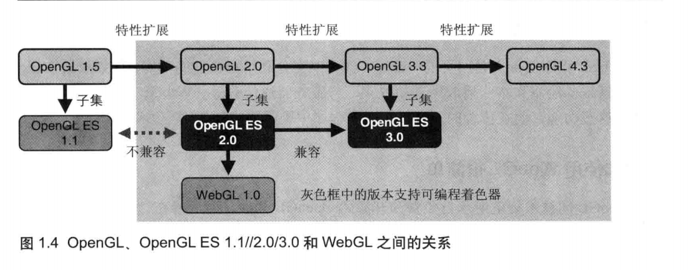
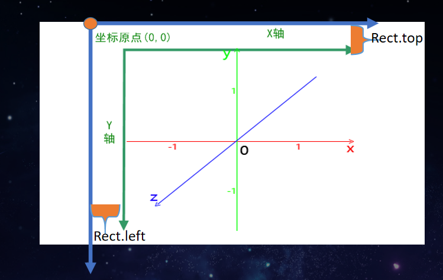
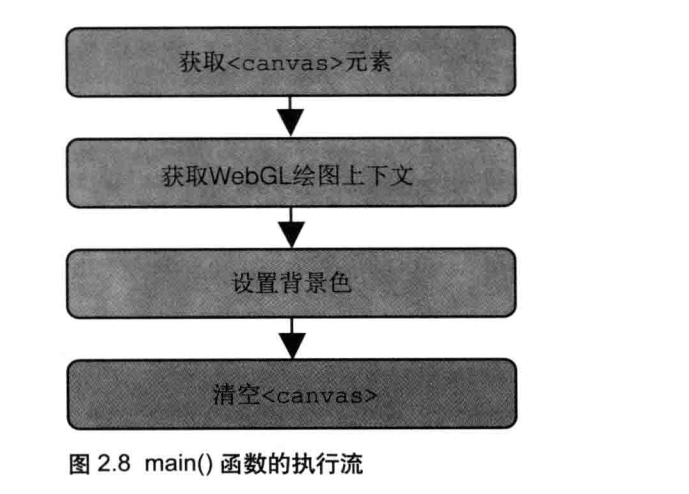
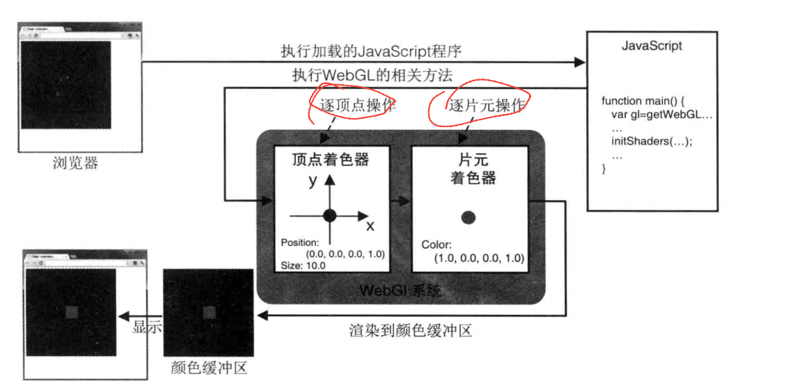
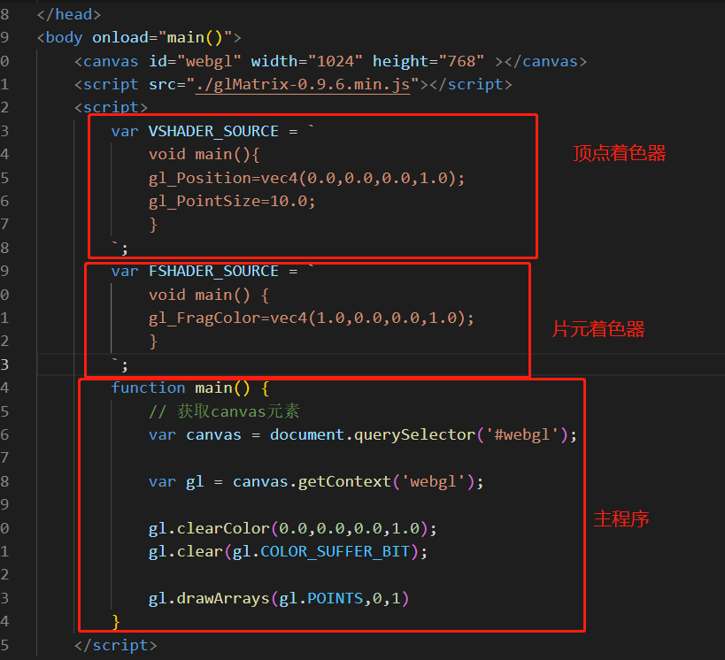
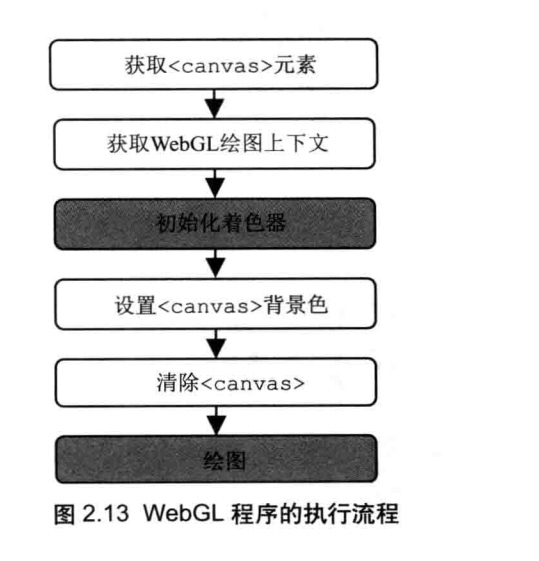
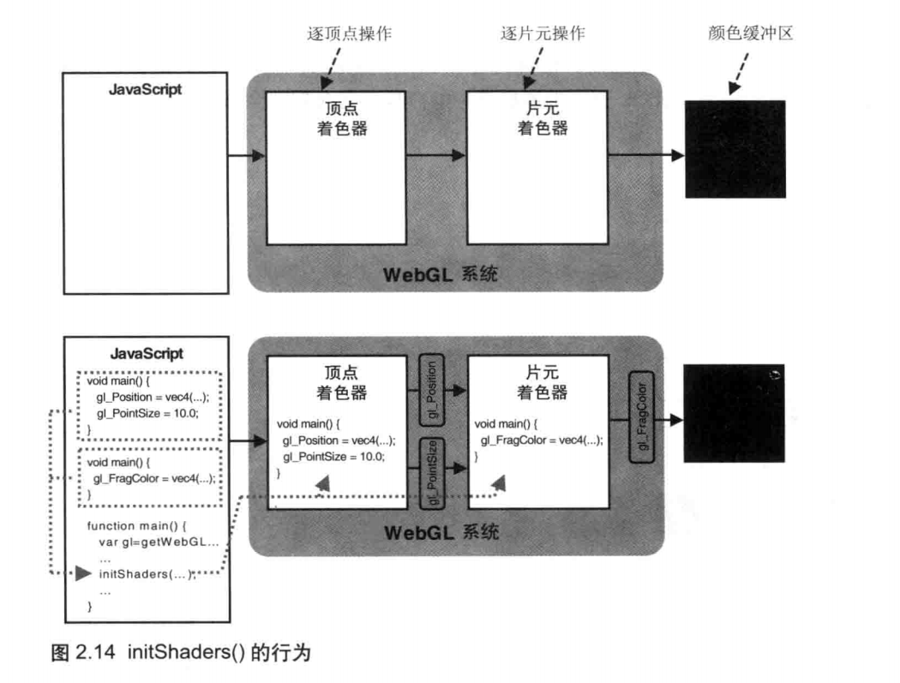
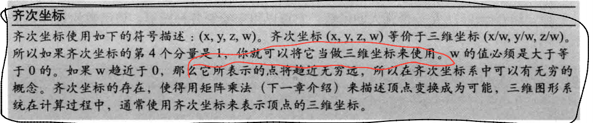

# WebGL

## WebGL前生今世

`WebGL`是一项用来在网页上面绘制和渲染复杂三维图形，并允许用户与之进行交互的技术。`WebGL`起源于`OpenGL`，但是实际上是从`OpenGL ES`中派生出来，`OpenGL ES`是`OpenGL`的一个特殊的版本，于2003年首次提出，并在2007年（ES 2.0）和2012年(ES 3.0)进行了两次的升级，我们的`WebGL`就是基于`OpenGL ES2`。

下面的图显示了`OpenGL`、`OpenGL ES 1.1/2.0/3.0`和 `WeGL`的关系。由于`OpenGL`本身已经从1.5发展到了2.0，再到4.3，所以`OpenGL ES` 被标准化为特定版本 `OpenGIOpenGL1.5`和`OpenGL2.0`的子集。



`OpenGL 2.0` 开始支持了一项非常重要的特性，即可编程着色器方法(programmable shader functions)。该特性被`OpenGL ES 2.0`继承，并成为了`WebGL1.0`标准的核心部分。

着色器方法，或称着色器，是使用一种类似于 C的编程语言实现了精美的视觉效果。编写着色器的语言又称为着色器语言(shading language)，`OpenGLES 2.0`基于`OpenGL着色器语言(GLSL)`，因此后者又被称为`OpenGL ES 着色器语言(GLSLES)`。`WebGL`基于`OpenGL ES 2.0`也使用`GLSLES`编写着色器。

`OpenGL`规范的更新和标准化由`Khronos组织`(一个非盈利的行业协会专注于制定发布、推广多种开放标准)负责。2009 年，`Khronos` 建立了 `WebGL` 工作小组，开始基于`OpenGL ES` 着手建立` WebGL`规范，并于2011年发布了 `WebGL`规范的第1个版本。

## 认识Canvas

在学习`WebGL`之前，我们需要了解一下`canvas`标签，`canvas`是`HTML5 `提出的用于图形的绘制，我们可以通过脚本 (通常是JavaScript)来完成我们想要的图案，比如二维的圆、正方形等，<canvas> 标签只是图形容器，必须使用脚本来绘制图形。

```html
<html>
  <head>
    <title>了解Canvas</title>
    <script type="text/javascript">
      function draw(){
        // 获取canvas元素
        var canvas = document.getElementById('tutorial');
        
        if (canvas.getContext){
          // 拿到canvas上下文
          var ctx = canvas.getContext('2d');
          //填充颜色
          ctx.fillStyle = "rgb(200,0,0)";
          // 绘制矩形
          ctx.fillRect (10, 10, 55, 50);
        }
      }
    </script>
    <style type="text/css">
      canvas { border: 1px solid black; }
    </style>
  </head>
  <body onload="draw();">
    <canvas id="tutorial" width="150" height="150">
    	您的浏览器版本过老，请升级浏览器版本！
    </canvas>
  </body>
</html>
```

我们需要值得注意的是，因为`Canvas`标签是`html5`新出的标签，所以可能有些老的浏览器会不支持，不支持的浏览器会直接忽略这一行，也就不会显示`canvas`，所以我们可以给一条错误信息，提示用户。

## WebGL坐标系统



## 了解WebGL

就跟学习其他语言的`hello world`一样，我们也来写一个`WebGL`版本的`hello world`。首先我们先看下面这一部分的代码。

```js
// HelloCanvas.js
function main() {
	// 通过id获取<canvas>元素
	var canvasDom = documentgetElementById('webgl');
	// 获取WebGL绘图上下文
	var gl = getContext('webgl');
	if (!gl){
        console.log('Failed to get the rendering context for WebGL');
        return;
    }
	// 指定清空<canvas>的颜色
	gl.clearColor(0.0，0.0，0.0，1.0);
	// 清空<canvas>
	gl.clear(gl.COLOR_BUFFER_BIT);
}
```

我们可以看到`main()`函数中执行了以下的流程，那么我们就来逐步的解答一下每个步骤。



### 获取canvas元素

跟二维绘图一样，我们需要一个画布来承接我们想要话的内容，在`WebGL`我们使用的是`canvns`标签来承接。通过`id`获取到对应的元素，存储到`canvasDom`变量中。

```html
<canvas id="webgl" width="1024" height="648"></canvas>

var canvasDom = documentgetElementById('webgl');
```

### 获取WebGL绘图上下文

通常来说，我们需要绘制三维的图形，我们需要通过`DOM`变量获取到`WebGL`绘图上下文。

```js
var gl = getContext('webgl');
```

同时我们需要值得注意的是`getContext()`在不同的浏览器可能会导致获取到的值不同。这样我们就拿到了`WebGL`的绘图上下文，我们就可以绘制三维图形了。一般来说，我们会将获取到的上下文命名为`gl`。

### 设置canvas 的背景色

在前面我记得提到过，canvas清空绘画区，不是像橡皮擦一样擦除掉，而是使用颜色覆盖绘画区，然后重新画。所以在清空绘画区之前，我们得指定背景颜色。

```js
gl.clearColor(0.0，0.0，0.0，1.0);
```

这里采用的也是`RGBA`的格式，但是又与我们常规的`RGBA`格式不同，普通的颜色分量值是`0-255`之间，这里的每个参数的范围是`0-1.0`，比如红色`(1.0,0.0,0.0,1.0)`，绿色`(0.0,1.0,0.0,1.0)`，蓝色`(0.0,0.0,1.0,1.0)`

一旦指定背景颜色之后，那么这个颜色就会暂存到WebGL系统中，在调用下一次的`gl.clearColor()`方法之前是不会改变的。

### 清空canvas

当我们设置好`canvas`的背景色之后，我们就可以清除已绘制的内容。我们说过，这里的清空实际上就是使用背景色填充绘制区域。

```js
// 清空<canvas>
gl.clear(gl.COLOR_BUFFER_BIT);
```

你可能会注意到有个参数`gl.COLOR_BUFFER_BIT`，这个参数代表的意思是指定颜色缓冲区。前面提到过`WebGL`是基于`OpenGL`的，而`OpenGL`是基于多基本缓冲区模型，所以我们清空绘制区域，实际上就是告诉`WebGL`清空颜色缓冲区。我们也可以使用`|`操作符来指定多个缓冲区

| 参数                  | 说明           |
| --------------------- | -------------- |
| gl.COLOR_BUFFER_BIT   | 指定颜色缓冲区 |
| gl.DEPTH_BUFFER_BIT   | 指定深度缓冲区 |
| gl.STENCIL_BUFFER_BIT | 指定模板缓冲区 |

如果没有指定背景颜色（没有调用`gl.clearColor`）就会使用默认的值

| 缓冲区名称 | 默认值              | 相关函数                            |
| ---------- | ------------------- | ----------------------------------- |
| 颜色缓冲区 | （0.0,0.0,0.0,0.0） | gl.clearColor(red,gren,blue,alphaa) |
| 深度缓冲区 | 1.0                 | gl.clearDepth(depth)                |
| 模板缓冲区 | 0                   | gl.clearStencil(s)                  |

到这里，`WebGL`版本的`Hello World`就结束了。

## 着色器

我们了解了`WebGL`之后，那么我们如果在三维坐标中画一个点，这个点我们将其画在（0.0,0.0,0.0）,上面我们已经讲过`canvas`和`webgl`以及浏览器坐标系之间的关系，所以我们知道，这个点会出现在`canvas`标签的中心位置。

在`WebGL`中绘制一个点并不像在二维中那么简单，`WebGL`依赖的是**着色器**的绘图机制。着色器是一个强大的功能，意味着使用其并不是一个简单的命令可以的。

接下来我们看下面的代码。

```html
<!DOCTYPE html>
<html lang="en">
<head>
    <meta charset="UTF-8">
    <meta http-equiv="X-UA-Compatible" content="IE=edge">
    <meta name="viewport" content="width=device-width, initial-scale=1.0">
    <title>着色器讲解</title>
</head>
<body onload="main()">
    <canvas id="webgl" width="1024" height="768" ></canvas>
    <script src="./glMatrix-0.9.6.min.js"></script>
    <script>
        var VSHADER_SOURCE = `
            void main(){
                gl_Position = vec4(0.0,0.0,0.0,1.0);
                gl_PointSize = 10.0;
            }
        `;
        var FSHADER_SOURCE = `
            void main() {
                gl_FragColor = vec4(1.0,0.0,0.0,1.0);
            }
        `;
        function main() {
            // 获取canvas元素
            var canvas = document.querySelector('#webgl');

            var gl = canvas.getContext('webgl');

            gl.clearColor(0.0,0.0,0.0,1.0);
            gl.clear(gl.COLOR_SUFFER_BIT);

            gl.drawArrays(gl.POINTS,0,1)
        }
    </script>
</body>
</html>
```

上面的代码结构，如果没有变动的话，就不会再次写出来，后面都是直接说`js`部分。

上面我们说到了，`WebGL`绘图一定要用到着色器，我们来看上面的这个程序，在这部分中，着色器是以字符串的形式存在的，我们后面来慢慢解释着色器。


### WebGL渲染显示流程

首先运行 JavaScript 程序调用了 WebGL的相关方法，然后顶点着色器和片元着色器就会执行，在颜色缓冲区内进行绘制，这时就清空了绘图区，最后，颜色缓冲区中的内容会自动在浏览器的<canvas>上显示出来。



这里有个点的地方是，颜色缓冲区的内容会自动显示在浏览器中。

### WebGL程序结构



顶点着色器和片元着色器，是以JavaScript字符串形式编写的着色器语言程序，这样主程序就可以将他们传给`WebGL`系统。

### 初始化着色器

在我们[获取canvas元素](### 获取canvas元素)那一小节我们也许见过类型的图形





初始化着色器的流程如上图，在这图中，我们知道`WebGL系统`是由顶点着色器和片元着色器组成的。在我们进行初始化着色器之前，顶点着色器和片元着色器都是空白的。然后我们将字符串类型的着色器代码从JavaScript中传到`WebGL系统`之中，并建立着色器。

顶点着色器先执行，它对`gl_Position`变量和`gl_Pointsize`变量进行赋值，并将它们传入片元着色器，然后片元着色器再执行。实际上，片元着色器接收到的是经过光栅化处理后的片元值，你可以简单地认为这两个变量从顶点着色器中被传入了片元着色器

### 着色器种类

`WebGL`的着色器有两种，一种是**顶点着色器(VSHADER_SOURCE )**，一种是**片元着色器(FSHADER_SOURCE)**

#### 顶点着色器

**顶点着色器(Vertex shader):** 顶点着色器是用来描述顶点特性(如位置、颜色等)的程序。顶点(vertex)是指二维或三维空间中的一个点，比如二维或三维图形的端点或交点

```js
		var VSHADER_SOURCE = `
            void main(){
            gl_Position=vec4(0.0,0.0,0.0,1.0);
            gl_PointSize=10.0;
            }
        `;
```

我们说了`webgl`是基于`OpenGL ES`的，所以他跟c程序相似，也是必须有一个`main()`函数，以及指定其返回值得类型，同时`main()`函数不能指定参数。

上面这段代码的意思是将点的位置赋值给`gl_Position`，将点的尺寸赋值给`gl_PointSize`。这两个变量是内置在顶点着色器中的,而且有着特殊的含义:`g1_Postion `表示顶点的位置(这里，就是要绘制的点的位置)，`g1_Pointsize` 表示点的尺寸。

| 类型                         | 变量名       | 描述               |
| ---------------------------- | ------------ | ------------------ |
| vec4（四个浮点数组成的矢量） | g1_Postion   | 顶点位置           |
| float（浮点数）              | g1_Pointsize | 点的尺寸（像素数） |

`gl_Position`必须赋值，不赋值就不能正常工作；`gl_PointSize`不赋值就默认10.0。

`GLLS ES`是强类型的语言，规范严格，不能将浮点数的类型赋值整数，比如这里的赋值是10.0，而不是10。

我们看到`g1_Postion`是四个浮点数组成的矢量，着色器内置了`vec4()`函数帮我们将其转换成矢量。

**注意：**赋给`gI_Position`的矢量中，我们添加了1.0作为第4个分量。由4个分量组成的矢量被称为**齐次坐标**，因为它能够提高处理三维数据的效率，所以在三维图形系统中被大量使用。虽然齐次坐标是四维的，但是如果其最后一个分量是 1.0，那么这个齐次坐标就可以表示“**前三个分量为坐标值**”的那个点。所以，当你需要用齐次坐标表示顶点坐标的时候，只要将最后一个分量赋为 1.0 就可以了。



#### 片元着色器

**片元着色器(Fragment shader):** 进行逐片元处理过程，片元(fragment)是一个`WebGL`术语,你可以将其理解为像素(图像的单元)。

```js
		var FSHADER_SOURCE = `
            void main() {
                gl_FragColor = vec4(1.0,0.0,0.0,1.0);
            }
        `;
```

顶点着色器控制位置和大小，片元着色器控制点的颜色。片元就是显示在屏幕上的一个像素(严格意义上来说，片元包括这个像素的位置、颜色和其他信息)。

片元着色器的作用就是处理片元，使其显示在屏幕上。片元着色器将点的颜色（类似于RGBA，不过这里的最大值是1，最小值是0）赋值给`gl_FragColor`,该变量是片元着色器的唯一内置变量，它控制着屏幕的最终颜色。

### 绘制

接下来我们就来到主程序的绘制阶段，我们使用`gl.drawArrays(mode,first,conut)`绘制，通过控制传参的不同，它可以绘制各种图形。

| gl.drawArrays(mode,first,conut) |                                                              |
| ------------------------------- | ------------------------------------------------------------ |
| mode                            | 指定绘制方式，gL.POINTS、gl.LINES、gl.LINE_STRIP、g1.LINE_LOOP、gl.TRIANGLES、gL.TRIANGLE_STRIP、gl.TRIANGLE_FAN |
| first                           | 指定从那个顶点开始绘制（整数型）                             |
| count                           | 指定需要用到多少个顶点（整数型）                             |


