## 序章

最重要的地图介绍，这游戏在游玩过程中你会一直在不同的地图模式间切来切去，而教程里对这个说的不够多，所以特别拎出来加强一下大家的印象。
这是右下角的地图按钮

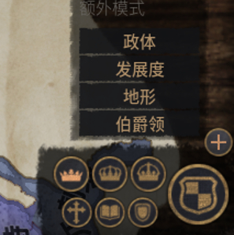

伯爵领：“+”号上面，ck最基础的地块（最低分封爵位为男爵）

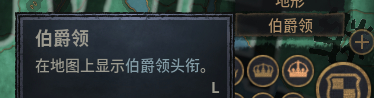

以芒斯特为例

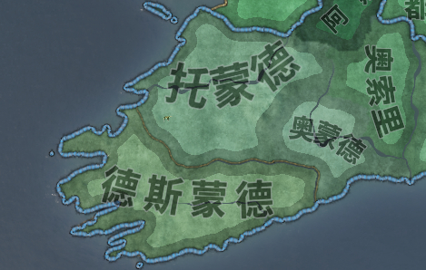

可以看到芒斯特由三个伯爵领组成，你占了2块

公爵头衔：公国/小王国，以后你经常打交道的手下的头衔，地图会以公爵领为基础显示势力范围，你目前为芒斯特小王国的统治者（这里小王国就是公爵领（公国），就是叫法不同）

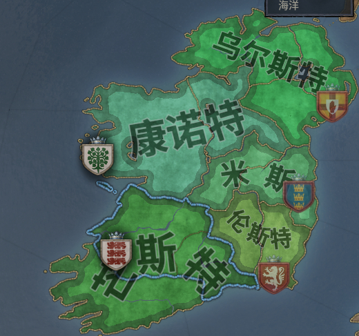

王国头衔：这个地图下面会显示各个王国，以英国为例，众所周知英国由“乃尔兰”、苏格兰、威尔士、英格兰四个王国组成

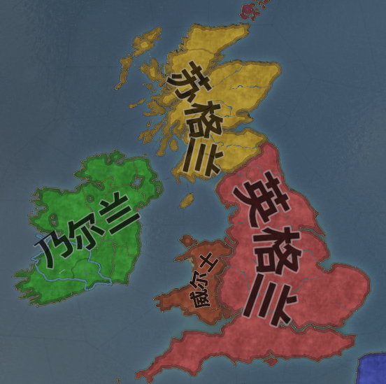

王国由公国/小王国组成，点击这个“乃尔兰”会显示更多信息

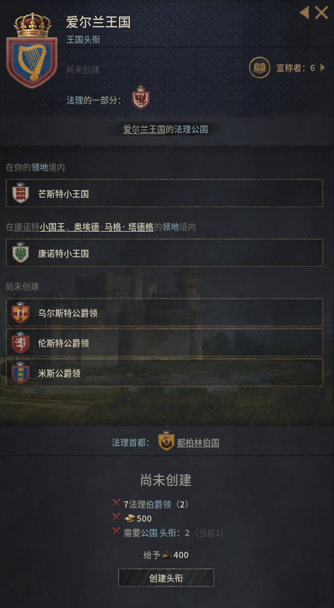

可以看到目前爱尔兰王国还没被创建，创建要求在下面写着，创建后你成为正宗国王，而不是什么自封的小国王
帝国头衔：由各个王国组成，我们的目标就是建立不列（宣盟)尼亚

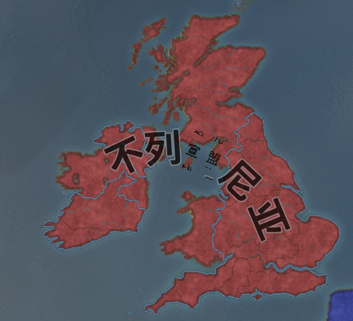

信仰：各个信仰的势力范围，这个玩法目前我接触的不多，之后只会涉及一小部分

文化：相当于科技树，不同的文化有不同的科技树，该文化下拥有最多领地，头衔最高的人为文化领袖，可以自己点研究方向

家族：玩家经营的主要单位，家族人物全部死亡，游戏结束

领地：方便查看各个npc的势力范围，很多情况下npc拥有不止一个公爵领

法理/宣称：你要打下一块领土，需要借口，借口有法理和宣称，这个宣称可以是你手下的（打下后的土地变手下的），可以是老婆的（打下后的土地变老婆的），可以是你伪造的（打下后就是你的），除了主教伪造宣称，另外最重要就是找有宣称的老婆/儿媳，收有宣称的手下。简单的说宣称就是房产证，你要占别人的地，需要这个房产证来证明你是合法的。法理简单点说就是自古以来，比如你自己是芒斯特小国王，统治着芒斯特小王国，对小王国下的所有土地拥有统治权

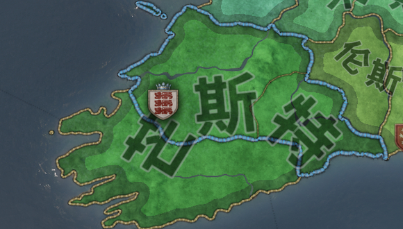

而德斯蒙德自古以来就是芒斯特不可分割的一部分，但他被别人占了

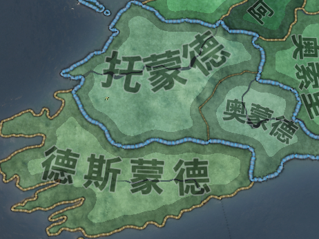

这时候你就可以通过芒斯特的法理为宣战借口而不用再伪造宣称

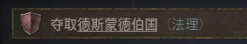

## 第一章、布里安的野望

开局先别急着走时间，我们先按照游戏提示操作

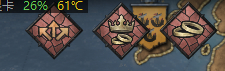

第一个：生活重心就点军事好了，具体怎么点无所谓，优先侠义,第一代的任务是尽量多拿地，为下一代成为爱尔兰国王创造条件，不过要求不用太高，我的第一代好像就拿了两三块地，宣战前看一下对方有没有盟友，开展后抓到对面领主直接获得100点战争点，基本算直接赢了。
外交状态在家徽下方，有盟友和停战协议，一般和对面领主的儿女结婚算默认结盟，前期可以抱大腿苟住。

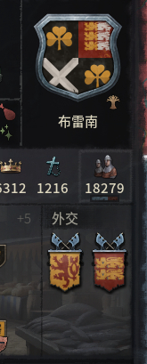

第二个：继承人婚姻无所，反正我们不以他为继承人，我的这个开局送的儿子是战死的
第三个：结婚，好了最关键的地方来了！最关键的地方来了！最关键的地方来了！
众所周知，当作为吊丝的时候，抱个白富美大腿是最有用的。这时，我们点开王国地图

选择英格兰，然后在王国界面点击书本的标志，头衔历史

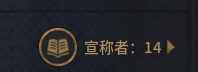

点开后找到忏悔者爱德华

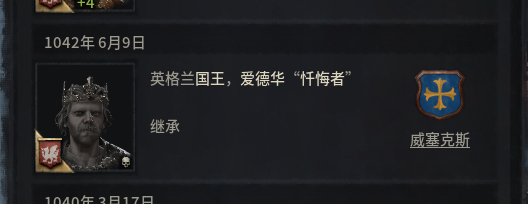

点击威塞克斯家族的图标，然后打开宗族树，找到这个小姐姐，女伯爵玛格丽特，这，将是你未来的老婆

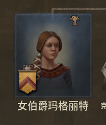

点开人物，可以看到她有英格兰的强宣称，宣称分为强宣称和弱宣称，弱宣称就是你让主教伪造的，后代不继承，而强宣称通过继承得来，比如老爹是国王，那么他的所有子女继承他的所有头衔的强宣称，而弱宣称则不继承

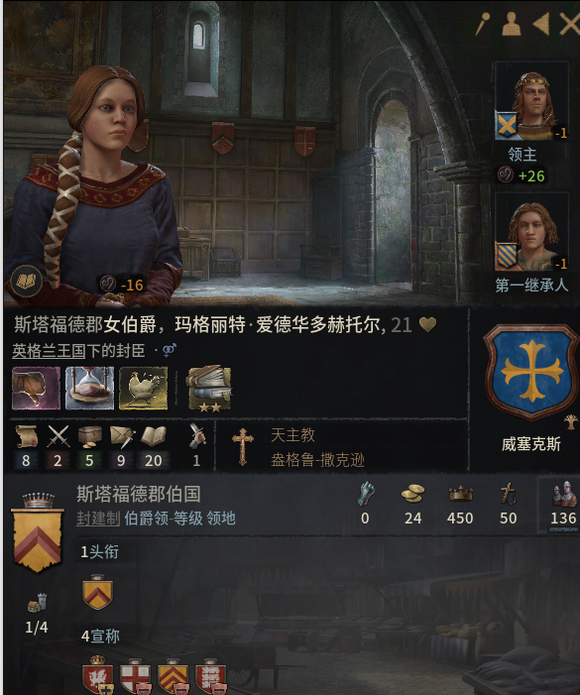

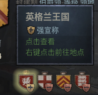

标准白富美，我称之为新手村向导。
然后就结婚吧，之后你就在爱尔兰里奋斗吧，这一代任务已经结束了。等你儿子出身，自然继承你老婆的强宣称
你和女伯爵的儿子出生后，让他妈当他监护人，记得刚生出来的时候就监护，把转变文化和信仰点上，长大了不一定成功，文化不转，不过英格兰文化比较快，我转了，

信仰一定要转！信仰一定要转！信仰一定要转！

这是一个保险，是什么保险我之后会说。

年龄小100%转成功，年龄大就随缘了

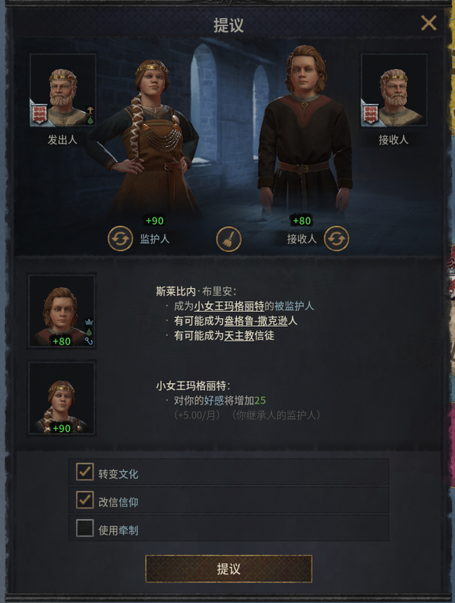

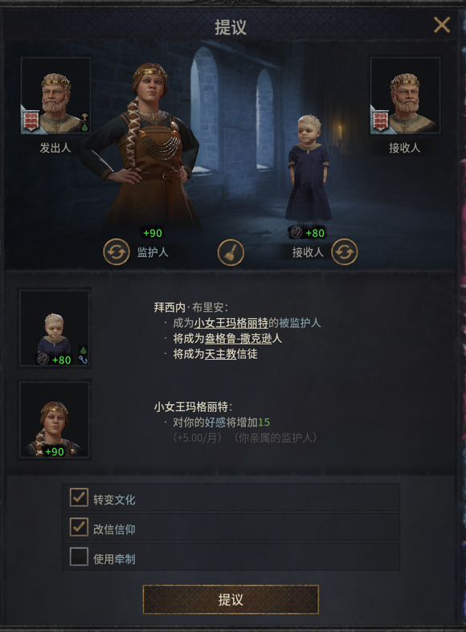

等儿子稍微长大了，可以选择教育重心，具体几岁不清楚，欢迎大佬补充

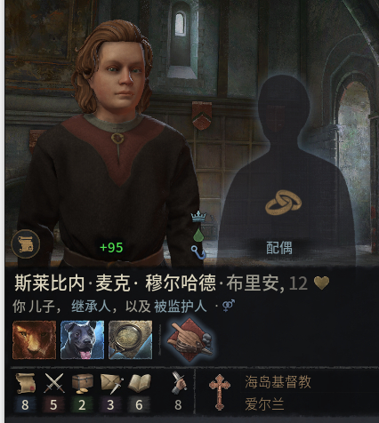

在人物面板左下角有个小图标，点击它

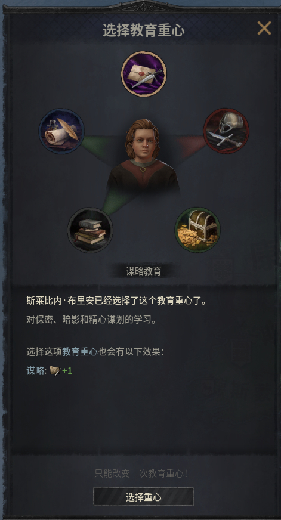

跳出教育重心选择谋略重心，没错你儿子就是要当一世枭雄
第一章，完。

## 第二章

公元1102年，新王莱斯比内（第二代，以后以罗马数字标识XX代）继位第12年赢得对其兄弟 韦赫特纳赫 的统一战争，并于同年10月22日建立爱尔兰王国，登基成为爱尔兰国王。
（部分领地未统一，不过这些都是煮熟的鸭子了，不可能飞的)

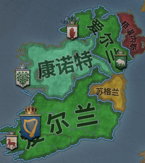

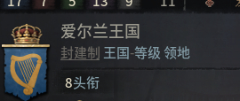

太后于建国前一年年老逝世

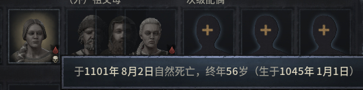

而我作为她的亲儿子，获得了英格兰王国的弱宣称（宣称逐代递减，头衔>强宣称>弱宣称>无)

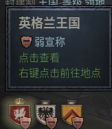

接下来就是夺取英格兰了

## 第三章、英格兰的征服者莱斯比内

选个高谋略的间谍首脑，然后在间谍首脑这里选中间这个支持密谋

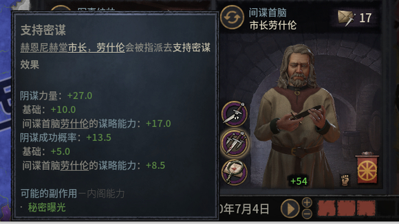

看一眼局势图，隔壁英格兰竟然被挪威占领了，岂有此理，不列颠的事应该由不列颠人说了算

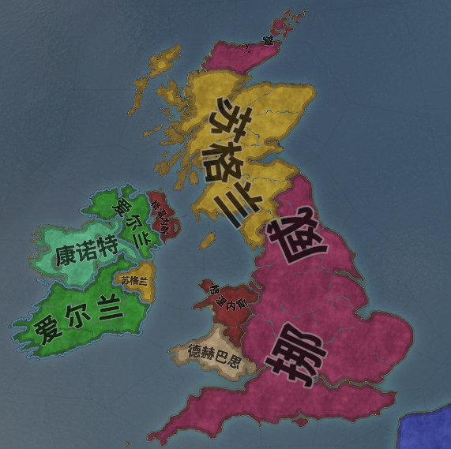

点开挪威国王，右键绑架，记得多存档

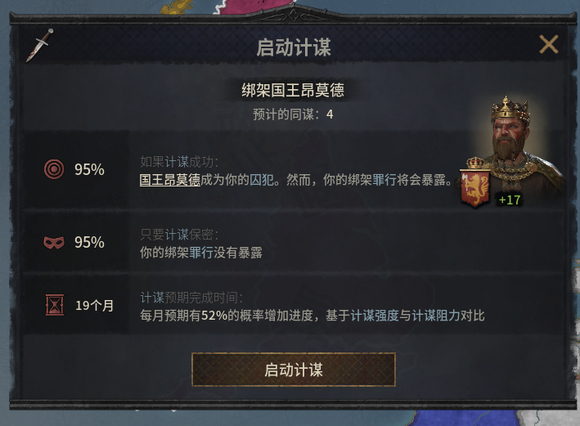

一年后

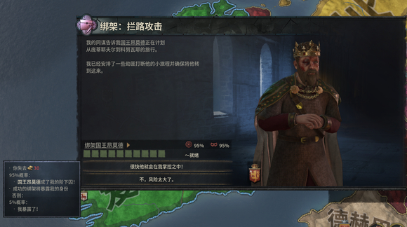

这里先别点确定！这里先别点确定！这里先别点确定！
这时候我们点开国王，然后宣战，选择你的宣称，目标英格兰，宣战！

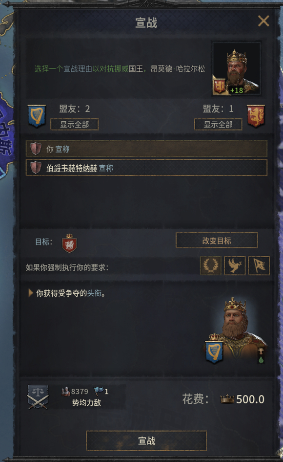

这时候可以点确定了，国王成功到手

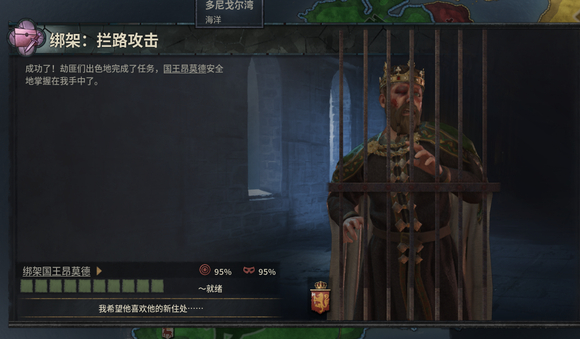

国王到手收点开交战面板可以看到战争分数直接满了

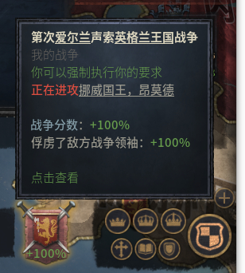

强制要求

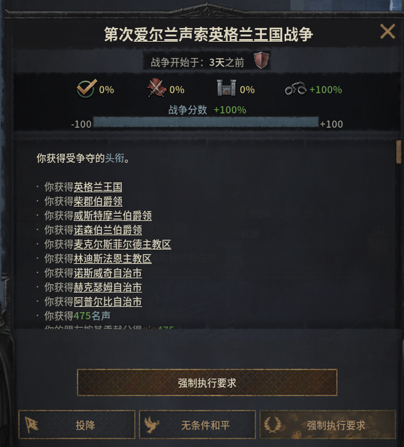

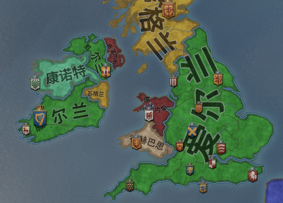

1111年12月21日，爱尔兰国王莱斯比内（II）成功征服英格兰，史称征服者莱斯比内（II）

大头结束了，接下来是内政方面，包括分封，通过运用不同的继承法（分割继承法为主）同时控制爱尔兰、威尔士、英格兰而不分裂，前期就能的操作，不用点长子继承，还有如何处理叛乱派系，如何为下一代铺路，如何把大部分领地拿在手上等，你尽管叛乱，能成功算我输。还有如何兵不血刃的统一苏格兰。
后面的运营楼主觉得才是最重要的，也是ck的乐趣所在，上面的其实都是些基础操作，没什么难度，如果你按照我的方法走到了这一步，那么接下来，恭喜你，手下大面积叛乱，并且每一代继位都有麻烦，后面会说如何处理。
楼主也摸索了很久包括与那个智障的 斯堪的纳威亚选举 搏斗，后来发现当时浪费了好几代，其实一代内就能解决

## 领地继承法

接下来领地继承法，是这个帖子的精华，建议大家仔细看
目前我拥有最高的2个头衔，爱尔兰国王和英格兰国王，这两个是平级的，上面说过，如果按照分割法，那么下一代必定分裂，注意，是按照分割法必定分裂

.jpg)

但你点开王国界面可以看到
英格兰用的是斯堪的纳威亚选举
可以看到英格兰王位继承人不是我儿子，而是路人
这个选举法比较坑，他的候选人是我的远亲、我的儿子，还有所有拥有英格兰宣称权的人（包括弱宣称）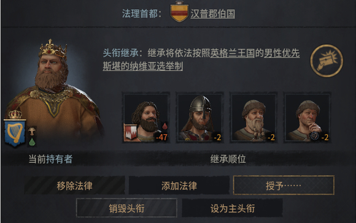

爱尔兰无继承法，默认使用我自己的继承法，继承人是我大儿子

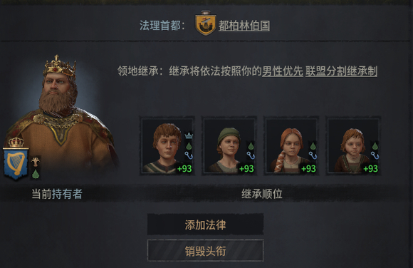

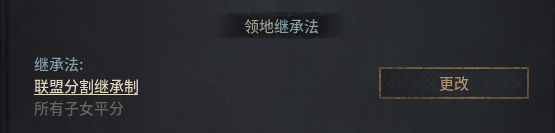

接下来我们重新搞一下，首先，把英格兰的继承法删了
但如果把英格兰的纳威亚选举删了，英格兰就默认使用分割继承法，头衔和爱尔兰相等，还是得分裂
所以我们给爱尔兰加一个封建选举制

.jpg)

这个选举的意思是，只有在爱尔兰的封臣和领主才能当选举人，所以选举人范围一下子缩小了
这是选举列表，总共就4个人，我是国王，拥有3票（基础1+国王2），我儿子2票（基础1+公爵1），所以基本就等于钦定候选人，主要要给儿子一个公爵领，还有儿子如果有“不热爱权力”的特点，他不会选自己，真是坑了个爹，“这王位不要也罢”√

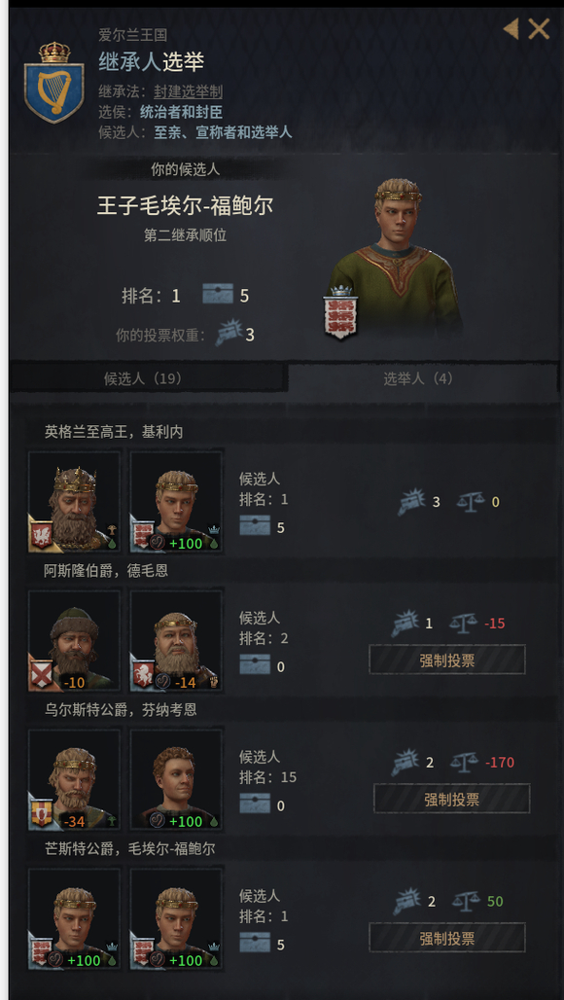

可以看到爱尔兰通过选举给大儿子，英格兰通过分割给大儿子，注意一定要把英格兰设为主头衔，因为分割法是从主头衔分割的，如果爱尔兰是主头衔，那么系统会判定大儿子已经有王国了，应该把英格兰分给二儿子

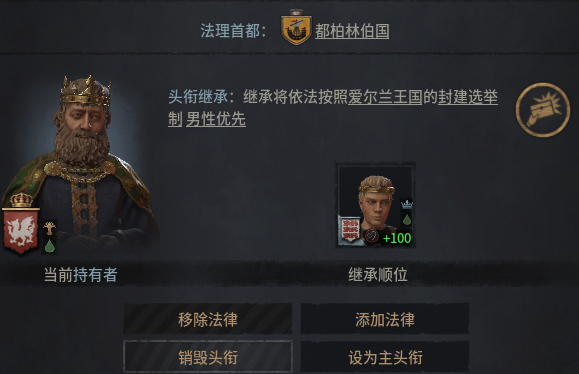

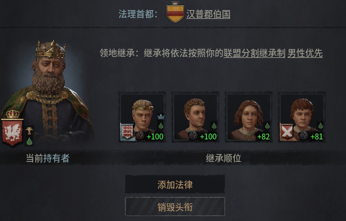

如果这时拥有威尔士也同理，封建选举制，自己当威尔士国王，大儿子当威尔士下的公爵，然后选举，这样就变成大儿子继承三个王国，那些公爵领也可以这样搞，自己当公爵，儿子当公爵下的伯爵，搞选举

总结：分割继承法是先排除所有拥有自己法律的王国/公国后再进行分割，王国自己的法律拥有优先权，所以难搞的王国/公国直接删法律，比较小的王国用选（独）举（裁）

这么多选举，威望不够怎么破

慢慢攒，创建头衔也可以获得威望，第二代只要凑够添加爱尔兰法律的威望就行，英格兰那里删法律是免费的，威尔士不急，毕竟底盘小，可以以后再创建，或者创建了分给二儿子，然后下一代再打回来就好，反正底盘小，随意怎么操作

